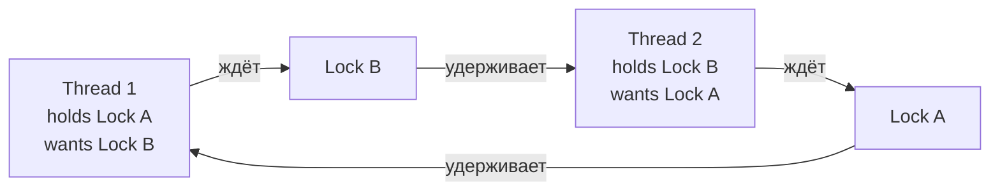
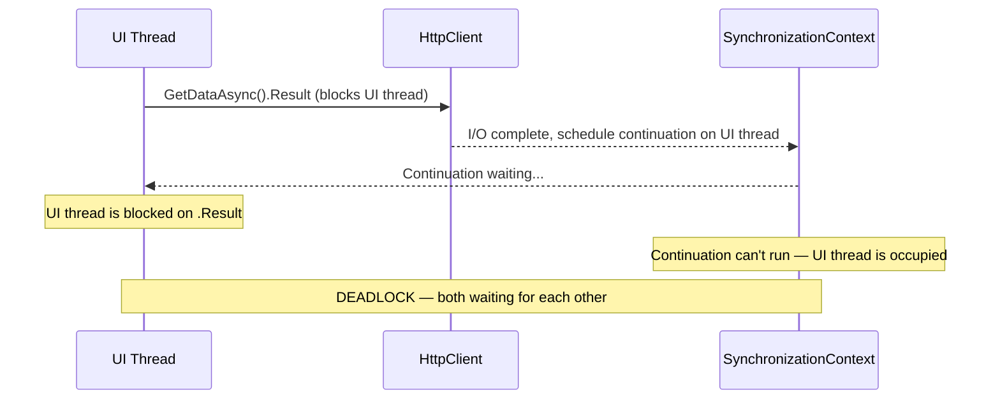

# Типичные проблемы синхронизации

> Deadlock, lock convoy, async deadlock и over-synchronization — четыре класса ошибок, которые уничтожают производительность или вешают приложение.

## Содержание
- [Deadlock](#deadlock)
- [Priority Inversion](#priority-inversion)
- [Lock Convoy](#lock-convoy)
- [Async Deadlock](#async-deadlock)
- [Over-synchronization](#over-synchronization)
- [См. также](#см-также)

---

## Deadlock

**Deadlock** — два или более потока ждут друг друга, ни один не может продолжить.

**Четыре условия Коффмана (все должны выполняться):**

1. **Mutual exclusion** — ресурс захватывается только одним потоком
2. **Hold and wait** — поток держит ресурс и ждёт другой
3. **No preemption** — ресурс нельзя отнять
4. **Circular wait** — цепочка потоков, каждый ждёт ресурс следующего



**Классический deadlock — нарушен порядок захвата:**

```csharp
private readonly object _lockA = new();
private readonly object _lockB = new();

// DEADLOCK: T1 захватывает A→B, T2 захватывает B→A
void Thread1()
{
    lock (_lockA)
    {
        Thread.Sleep(1); // увеличиваем шанс interleaving
        lock (_lockB)    // ждёт B, если T2 уже держит B
        {
            DoWork();
        }
    }
}

void Thread2()
{
    lock (_lockB)
    {
        Thread.Sleep(1);
        lock (_lockA)    // ждёт A, если T1 уже держит A
        {
            DoWork();
        }
    }
}
```

**Решение — lock ordering:** всегда захватывать lock'и в одном порядке. Если все потоки захватывают A→B, circular wait невозможен.

```csharp
// БЕЗОПАСНО: оба потока захватывают A, потом B
void SafeThread1() { lock (_lockA) { lock (_lockB) { DoWork(); } } }
void SafeThread2() { lock (_lockA) { lock (_lockB) { DoWork(); } } }
```

**Для динамических lock'ов — сортировка по hashcode:**

```csharp
/// <summary>
/// Lock two accounts in consistent order to prevent deadlock.
/// </summary>
void Transfer(Account from, Account to, decimal amount)
{
    object first  = from.GetHashCode() <= to.GetHashCode() ? from.Lock : to.Lock;
    object second = from.GetHashCode() <= to.GetHashCode() ? to.Lock : from.Lock;

    // Обработка коллизий хешей: глобальный tie-breaker
    if (from.GetHashCode() == to.GetHashCode())
    {
        lock (_tieBreaker) lock (from.Lock) lock (to.Lock)
            ExecuteTransfer(from, to, amount);
        return;
    }

    lock (first) lock (second)
        ExecuteTransfer(from, to, amount);
}
```

---

## Priority Inversion

**Что это:** высокоприоритетный поток ждёт lock, удерживаемый низкоприоритетным потоком. Низкоприоритетный не получает CPU, потому что среднеприоритетные потоки его вытесняют.

```
Без priority inversion:
  High:   [run]----[wait for lock]---[run]
  Low:    ------[run, holds lock]----[release]

С priority inversion:
  High:   [run]----[wait for lock]----------- (голодает)
  Medium: ------[run][run][run][run][run]      (вытесняет Low)
  Low:    ------[holds lock, preempted]------- (не может отпустить lock)
```

**В .NET менее критично** чем в RTOS:
1. ThreadPool не использует приоритеты агрессивно
2. ОС применяет **priority boosting** — если поток долго не получает CPU, приоритет временно повышается
3. `Monitor` не реализует priority inheritance

**Рекомендация:** не использовать `Thread.Priority` в .NET приложениях. Если нужна приоритизация — реализовывайте на уровне приложения (разные очереди, разные Channel'ы для разных приоритетов).

---

## Lock Convoy

**Что это:** множество потоков выстраиваются «конвоем» у одного lock'а. Даже если критическая секция короткая — потоки тратят большую часть времени на ожидание.

**Механизм:**

```
1. Поток A держит lock. Потоки B, C, D ждут.
2. A отпускает → ОС будит B (FIFO-like).
3. B на другом ядре — context switch + cache miss (~1-2 мкс).
   Пока B просыпается, lock ПРОСТАИВАЕТ.
4. B захватывает. A снова хочет lock? — A может обогнать D (который уже долго ждёт).
5. Цикл повторяется → "convoy" → throughput деградирует.
```

**Причина:** ОС не имеет понятия, что критическая секция короткая. Она честно делает context switch, тратя ~1-2 мкс, тогда как сама секция занимала 100 нс.

```csharp
// ПЛОХО: lock convoy — длинная секция блокирует всех
void BadApproach(string data)
{
    lock (_lock)
    {
        var processed = ExpensiveComputation(data); // долго, не нуждается в lock
        _results.Add(processed);                     // быстро, нуждается в lock
    }
}

// ХОРОШО: минимизировать время внутри lock
void GoodApproach(string data)
{
    var processed = ExpensiveComputation(data); // вне lock
    lock (_lock)
    {
        _results.Add(processed); // только shared state
    }
}
```

**Решения:**
- Вынести вычисления из lock (как выше)
- `ReaderWriterLockSlim` для read-heavy нагрузок
- Lock striping (`ConcurrentDictionary` делает это автоматически)
- Lock-free алгоритмы

---

## Async Deadlock

**Что это:** вызов `.Result` или `.Wait()` на async-методе в контексте с `SynchronizationContext` блокирует поток. Continuation не может выполниться на том же потоке → deadlock.

```csharp
// WPF / WinForms:
void OnClick(object sender, EventArgs e)
{
    var result = GetDataAsync().Result; // DEADLOCK
}

async Task<string> GetDataAsync()
{
    var data = await httpClient.GetStringAsync(url);
    // continuation хочет вернуться на UI-поток (SyncContext)
    // но UI-поток заблокирован на .Result
    return data;
}
```



**В ASP.NET Core эта проблема не существует** — `SynchronizationContext` отсутствует, continuation идёт на любой поток пула.

**Три решения:**

```csharp
// 1. async all the way (лучшее решение)
async void OnClick(object sender, EventArgs e)
{
    var result = await GetDataAsync(); // не блокируем UI
}

// 2. ConfigureAwait(false) в библиотечном коде
async Task<string> GetDataAsync()
{
    var data = await httpClient.GetStringAsync(url).ConfigureAwait(false);
    // continuation не требует SyncContext → не дедлочится
    return data;
}

// 3. Task.Run (крайний случай — выполняет без SyncContext)
void OnClick(object sender, EventArgs e)
{
    var result = Task.Run(() => GetDataAsync()).Result; // SyncContext не у Task.Run
}
```

---

## Over-synchronization

**Что это:** чрезмерное использование lock'ов или слишком грубая гранулярность. Симптомы: низкое использование CPU при высокой нагрузке, throughput не растёт с добавлением ядер.

**Антипаттерн 1 — lock на весь метод включая I/O:**

```csharp
// ПЛОХО: весь метод под lock, включая I/O
void BadProcess(Order order)
{
    lock (_lock)
    {
        Validate(order);              // CPU, не нуждается в lock
        var result = CallApi(order);  // I/O, БЛОКИРУЕТ ВСЕХ!
        _database.Save(result);       // I/O
        _cache.Update(result);        // нуждается в lock (shared state)
    }
}

// ХОРОШО: lock только вокруг shared state
void GoodProcess(Order order)
{
    Validate(order);
    var result = CallApi(order);
    _database.Save(result);
    lock (_lock) { _cache.Update(result); }
}
```

**Антипаттерн 2 — lock(this):**

```csharp
// ПЛОХО: внешний код может сделать lock(myService) → deadlock или interference
class BadService
{
    public void Process()
    {
        lock (this) { DoWork(); }
    }
}

// ХОРОШО: приватный объект
class GoodService
{
    private readonly object _lock = new();
    public void Process()
    {
        lock (_lock) { DoWork(); }
    }
}
```

**Антипаттерн 3 — lock(typeof(T)):**

```csharp
// ПЛОХО: один глобальный lock для всех экземпляров MyService<string>
class MyService<T>
{
    public void Process()
    {
        lock (typeof(T)) { DoWork(); } // ГЛОБАЛЬНЫЙ lock!
    }
}
```

**Антипаттерн 4 — lock на строки (string interning):**

```csharp
// ПЛОХО: "my-lock" интернируется — один объект для всего AppDomain
lock ("my-lock") { DoWork(); }

// ХОРОШО
private static readonly object _lock = new();
lock (_lock) { DoWork(); }
```

**Антипаттерн 5 — lock там, где хватает concurrent коллекции:**

```csharp
// ПЛОХО: ручной lock вокруг Dictionary
private readonly Dictionary<string, int> _dict = new();
private readonly object _lock = new();

void Add(string key, int value)
{
    lock (_lock) { _dict[key] = value; }
}

// ХОРОШО: concurrent коллекция делает это сама
private readonly ConcurrentDictionary<string, int> _dict = new();

void Add(string key, int value)
{
    _dict[key] = value; // no explicit lock needed
}
```

---

## См. также

- [02-lock-monitor.md](./02-lock-monitor.md) — lock / Monitor: правильное использование
- [06-async-sync.md](./06-async-sync.md) — async deadlock и SemaphoreSlim.WaitAsync
- [07-concurrent-collections.md](./07-concurrent-collections.md) — lock-free коллекции как способ избежать over-synchronization
