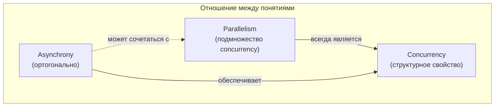

# Concurrency, Parallelism, Asynchrony

> Три понятия постоянно путают. Они ортогональны — понимание различий определяет выбор инструмента.

## Содержание
- [Concurrency — конкурентность](#concurrency)
- [Parallelism — параллелизм](#parallelism)
- [Asynchrony — асинхронность](#asynchrony)
- [Сравнение на таймлайне](#сравнение-на-таймлайне)
- [Отношение между понятиями](#отношение-между-понятиями)
- [Правило выбора инструмента](#правило-выбора-инструмента)
- [См. также](#см-также)

---

## Concurrency

**Несколько задач перекрываются по времени.** Не обязательно выполняются физически одновременно — достаточно, чтобы их временные интервалы пересекались (interleaving). Один процессор обеспечивает конкурентность через переключение контекста.

Ключевая идея: конкурентность — свойство **структуры** программы. Программа конкурентна, если спроектирована так, что несколько задач могут быть «в процессе» одновременно.

```csharp
// Concurrency без параллелизма — один поток, два task'а
async Task Demonstrate()
{
    var task1 = ProcessOrderAsync("ORD-001");
    var task2 = ProcessOrderAsync("ORD-002");
    // task1 и task2 конкурентны: оба «в полёте»
    // Пока один ждёт I/O, выполняется другой — на том же потоке
    await Task.WhenAll(task1, task2);
}
```

---

## Parallelism

**Несколько задач физически выполняются одновременно на разных ядрах.** Параллелизм — подмножество конкурентности. Всякий параллелизм конкурентен, но не наоборот.

Ключевая идея: параллелизм — свойство **выполнения**, а не структуры. Ускоряет **CPU-bound** работу.

```csharp
// Parallelism — несколько потоков на разных ядрах
Parallel.For(0, 1_000_000, i =>
{
    // Каждая итерация — CPU-bound вычисление на отдельном ядре
    matrix[i] = Math.Sqrt(matrix[i]) * Math.PI;
});
```

---

## Asynchrony

**Неблокирующее ожидание завершения I/O-операции.** Поток не занят во время ожидания — возвращается в пул и обслуживает другие задачи.

Ключевая идея: асинхронность — **не** про скорость вычислений. Про **эффективное использование потоков**. Один сервер с 16 потоками обслуживает тысячи HTTP-запросов, если потоки не заняты ожиданием ответа от БД.

```csharp
// Asynchrony — поток свободен, пока ждём I/O
async Task<Order> Load(string id, CancellationToken token)
{
    // Поток возвращается в пул на время HTTP-запроса
    var response = await httpClient.GetAsync($"/orders/{id}", token);
    // Continuation выполняется на любом свободном потоке из пула
    return JsonSerializer.Deserialize<Order>(
        await response.Content.ReadAsStringAsync(token));
}
```

---

## Сравнение на таймлайне

```mermaid
gantt
    title Concurrency vs Parallelism vs Asynchrony
    dateFormat X
    axisFormat %s

    section Concurrency (1 core, переключение)
    Task A (CPU)    :a1, 0, 3
    Task B (CPU)    :b1, 3, 6
    Task A (CPU)    :a2, 6, 9
    Task B (CPU)    :b2, 9, 12

    section Parallelism (2 cores)
    Task A (Core 1) :c1, 0, 6
    Task B (Core 2) :c2, 0, 6

    section Asynchrony (1 thread, I/O)
    Task A (CPU)    :d1, 0, 2
    Task A (I/O)    :crit, d2, 2, 8
    Task B (CPU)    :d3, 2, 4
    Task B (I/O)    :crit, d4, 4, 10
    Task A (CPU)    :d5, 8, 10
    Task B (CPU)    :d6, 10, 12
```



| Свойство | Concurrency | Parallelism | Asynchrony |
|----------|-------------|-------------|------------|
| **Что решает** | Структура программы | Скорость вычислений | Эффективность I/O |
| **Нужны ли несколько ядер** | Нет | Да | Нет |
| **Тип работы** | Любой | CPU-bound | I/O-bound |
| **Механизм в .NET** | Task, async/await | Parallel.*, PLINQ | async/await, IOCP |
| **Потоки заняты** | Зависит | Да, все ядра | Нет, потоки свободны |

---

## Отношение между понятиями



Комбинации, которые встречаются в реальном коде:

- **Concurrency без parallelism:** `async/await` на одном потоке (Console, тесты с синхронным SynchronizationContext)
- **Parallelism:** `Parallel.For` на массиве — несколько потоков, физически параллельно
- **Asynchrony + concurrency:** `Task.WhenAll` с I/O — несколько операций в полёте, один поток
- **Все три:** `Parallel.ForEachAsync` — несколько ядер (parallelism), async I/O внутри (asynchrony), задачи перекрываются (concurrency)

---

## Правило выбора инструмента

```
CPU-bound → Parallelism → Parallel.*, PLINQ, Task.Run
I/O-bound → Asynchrony → async/await, Task.WhenAll
Координация → Concurrency → Channel<T>, Dataflow
```

**Антипаттерн — перепутать типы:**

```csharp
// ПЛОХО: async для CPU-bound в библиотеке (обманывает caller'а)
public Task<int> CalculateAsync(int x)
    => Task.Run(() => Calculate(x)); // просто занимает поток пула

// ПЛОХО: Parallel для I/O-bound (блокирует потоки)
Parallel.ForEach(urls, url =>
{
    var html = httpClient.GetStringAsync(url).Result; // BLOCKED + starvation risk
});

// ПРАВИЛЬНО: каждому своё
await Parallel.ForEachAsync(urls,
    new ParallelOptions { MaxDegreeOfParallelism = 20 },
    async (url, token) => await ProcessAsync(url, token));
```

---

## См. также

- [02-task-run.md](./02-task-run.md) — Task.Run: запуск CPU-bound работы на ThreadPool
- [03-parallel.md](./03-parallel.md) — Parallel.*: параллелизм для коллекций
- [04-plinq.md](./04-plinq.md) — PLINQ: параллельный LINQ для трансформаций
- [07-problems.md](./07-problems.md) — почему смешивать sync и async в Parallel.* опасно
