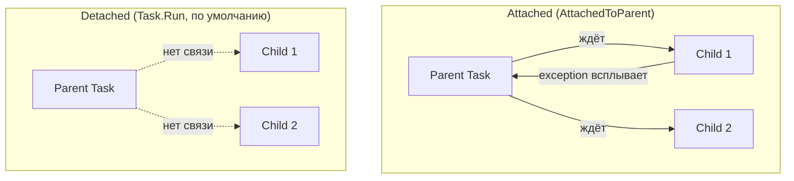

# Task.Run и управление Task'ами

> Task.Run — правильный способ запустить CPU-bound работу на ThreadPool. Всё остальное — частные случаи.

## Содержание
- [Task.Run изнутри](#taskrun-изнутри)
- [Task.Run vs Task.Factory.StartNew](#taskrun-vs-taskfactorystartnew)
- [TaskCreationOptions](#taskcreationoptions)
- [ContinueWith и его проблемы](#continuewith)
- [Parent/Child tasks](#parentchild-tasks)
- [Подводные камни](#подводные-камни)
- [См. также](#см-также)

---

## Task.Run изнутри

`Task.Run` ставит делегат в **глобальную очередь** ThreadPool. Первый свободный worker-поток его подхватит.

```csharp
Task<double> task = Task.Run(() =>
{
    // Выполняется на worker-потоке из пула
    double result = 0;
    for (int i = 0; i < 10_000_000; i++)
        result += Math.Sqrt(i);
    return result;
});

double value = await task; // текущий поток свободен пока идёт вычисление
```

**Что Task.Run делает внутри:**

```csharp
// Упрощённо:
public static Task Run(Action action)
{
    var task = new Task(action, CancellationToken.None,
        TaskCreationOptions.DenyChildAttach);
    task.ScheduleAndStart(needsProtection: false);
    // Внутри: ThreadPool.UnsafeQueueUserWorkItemInternal(task, ...)
    return task;
}
```

**Три гарантии Task.Run:**
1. Всегда использует `TaskScheduler.Default` (ThreadPool) — игнорирует `TaskScheduler.Current`
2. Автоматически устанавливает `DenyChildAttach` — дочерние Task'и не прилипают
3. Для async-делегата автоматически разворачивает `Task<Task<T>>` в `Task<T>`

```csharp
// Async-делегат: тип Task<string>, а не Task<Task<string>>
Task<string> task = Task.Run(async () =>
{
    await Task.Delay(100);
    return "done";
});
// Task.Run сделал Unwrap автоматически
```

---

## Task.Run vs Task.Factory.StartNew

**Используй Task.Run по умолчанию.** `Task.Factory.StartNew` нужен только для тонкого контроля.

| Аспект | Task.Run | Task.Factory.StartNew |
|--------|----------|----------------------|
| **TaskScheduler** | Всегда `Default` (ThreadPool) | `TaskScheduler.Current` (!!) |
| **DenyChildAttach** | Да, автоматически | Нет по умолчанию |
| **Async-делегат** | Unwrap автоматически | Возвращает `Task<Task<T>>` |
| **Когда использовать** | 99% случаев | Кастомный scheduler, LongRunning |

**Ловушка с TaskScheduler.Current:**

```csharp
// ОПАСНО: Task.Factory.StartNew наследует TaskScheduler.Current
Task.Factory.StartNew(() =>
{
    // Если родитель на UI-scheduler — вложенный тоже попадёт на UI-поток!
    Task.Factory.StartNew(() =>
    {
        HeavyComputation(); // Заморозит UI!
    });
});

// БЕЗОПАСНО: Task.Run всегда на ThreadPool
Task.Run(() =>
{
    Task.Run(() =>
    {
        HeavyComputation(); // Гарантированно на ThreadPool
    });
});
```

**Ловушка с async-делегатом:**

```csharp
// Task.Factory.StartNew — НЕ разворачивает Task<Task<T>>!
Task<Task<string>> outer = Task.Factory.StartNew(async () =>
{
    await Task.Delay(1000);
    return "result";
});

// await outer даёт внутренний Task, не "result"
Task<string> inner = await outer;
string result = await inner; // только теперь результат

// Нужно вручную Unwrap:
Task<string> correct = Task.Factory.StartNew(async () =>
{
    await Task.Delay(1000);
    return "result";
}).Unwrap();

// Или просто используй Task.Run:
Task<string> simple = Task.Run(async () =>
{
    await Task.Delay(1000);
    return "result";
});
```

---

## TaskCreationOptions

Флаги, управляющие поведением Task при создании через `Task.Factory.StartNew` или `new Task()`.

| Опция | Что делает | Когда использовать |
|-------|-----------|-------------------|
| `DenyChildAttach` | Запрещает дочерним Task'ам прикрепляться | Всегда с `StartNew` (Task.Run ставит автоматически) |
| `LongRunning` | Создаёт **отдельный поток**, не из пула | Долгие CPU-bound операции (минуты) |
| `RunContinuationsAsynchronously` | Continuation'ы ставятся в очередь, не инлайново | Для `TaskCompletionSource` |
| `PreferFairness` | FIFO вместо LIFO | Редко. Когда важен порядок запуска |
| `AttachedToParent` | Task становится дочерним | Легаси. Не используй в новом коде |

**LongRunning — выделенный поток:**

```csharp
// LongRunning создаёт ОТДЕЛЬНЫЙ поток (не из пула)
// Подходит для долгих фоновых задач, которые нельзя прерывать
var task = Task.Factory.StartNew(() =>
{
    while (!ct.IsCancellationRequested)
    {
        PollExternalSystem();
        Thread.Sleep(5000); // допустимо — поток не из пула
    }
}, ct, TaskCreationOptions.LongRunning, TaskScheduler.Default);
```

`LongRunning` — **подсказка** планировщику, не гарантия. `ThreadPoolTaskScheduler` создаёт отдельный поток, но кастомный scheduler может проигнорировать. С `Task.Run` не работает.

**RunContinuationsAsynchronously — стек-дайв:**

```csharp
// БЕЗ флага: SetResult выполняет все continuation'ы инлайново
// 100 continuation'ов → глубокий стек → StackOverflowException
var tcs = new TaskCompletionSource<int>();
for (int i = 0; i < 100; i++)
    tcs.Task.ContinueWith(_ => Process(i));
tcs.SetResult(42); // выполнит все 100 инлайново!

// С флагом: SetResult ставит в очередь — безопасно
var safeTcs = new TaskCompletionSource<int>(
    TaskCreationOptions.RunContinuationsAsynchronously);
safeTcs.SetResult(42); // поставит в очередь ThreadPool
```

---

## ContinueWith

Ручная подписка continuation — способ до `async/await`. В новом коде почти всегда лучше `await`.

**Главная ловушка — TaskScheduler.Current:**

```csharp
// ContinueWith использует TaskScheduler.Current, а не Default!
await Task.Factory.StartNew(() =>
{
    Task.Factory.StartNew(() => LoadData())
        .ContinueWith(t =>
        {
            // Может выполниться на UI-потоке если родитель на UI-scheduler!
            ProcessResult(t.Result);
        });
        // Нужно явно указывать:
        // .ContinueWith(t => ..., TaskScheduler.Default);
});
```

**Другие проблемы:**

```csharp
// 1. Исключение — AggregateException, а не оригинальное
Task.Run(() => throw new InvalidOperationException("oops"))
    .ContinueWith(t =>
    {
        var ex = t.Exception.InnerException; // нужно разворачивать вручную
    });

// 2. Выполняется при любом исходе (успех, ошибка, отмена)
Task.Run(() => throw new InvalidOperationException())
    .ContinueWith(t =>
    {
        var data = t.Result; // BANG: бросит AggregateException
    });

// Правильно — если всё же нужен ContinueWith:
Task.Run(() => Compute())
    .ContinueWith(
        t => Handle(t.Result),
        CancellationToken.None,
        TaskContinuationOptions.OnlyOnRanToCompletion,
        TaskScheduler.Default);
```

---

## Parent/Child tasks

**Attached** — дочерний Task прикреплён к родителю. Родитель не завершается, пока не завершатся все attached дочерние. Их исключения всплывают в родителя.

**Detached** — никакой связи. Дочерний Task живёт сам по себе. Это поведение по умолчанию для `Task.Run`.



```csharp
// Attached child — Parent.Wait() ждёт и дочернюю
var parent = Task.Factory.StartNew(() =>
{
    Task.Factory.StartNew(() =>
    {
        Thread.Sleep(2000);
        Console.WriteLine("Child done");
    }, TaskCreationOptions.AttachedToParent);
    Console.WriteLine("Parent body done");
});

parent.Wait();
// Выведет: "Parent body done", потом "Child done"
// parent.Status == RanToCompletion только после дочерней
```

```csharp
// DenyChildAttach — прикрепление игнорируется
var parent = Task.Factory.StartNew(() =>
{
    Task.Factory.StartNew(() =>
    {
        Thread.Sleep(5000);
    }, TaskCreationOptions.AttachedToParent); // ignored!
}, TaskCreationOptions.DenyChildAttach);

parent.Wait(); // завершится сразу, не ждёт дочернюю
```

В современном коде `AttachedToParent` — легаси. Для координации нескольких Task'ов используй `Task.WhenAll`.

---

## Подводные камни

**Task.Run для I/O-bound в библиотеке** — антипаттерн. Caller думает, что это async I/O, а на деле поток пула заблокирован. В ASP.NET хуже синхронного вызова: занимаются два потока (текущий ждёт, второй считает).

**Забытый `await` на Task.Run** — Task запустится, но результат и исключения потеряются. Компилятор даёт предупреждение CS4014, но не ошибку.

**Task.Run + `.Result` внутри другого Task.Run** — два потока пула занято одной задачей. При нагрузке ведёт к thread starvation.

---

## См. также

- [01-concurrency-vs-parallelism.md](./01-concurrency-vs-parallelism.md) — когда Task.Run нужен, а когда async/await
- [03-parallel.md](./03-parallel.md) — Parallel.* для коллекций (эффективнее Task.Run в цикле)
- [07-problems.md](./07-problems.md) — thread starvation при смешивании Task.Run и блокирующего кода
