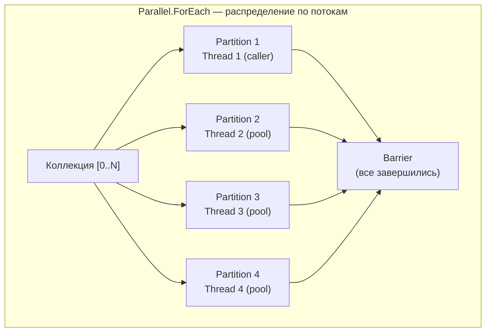
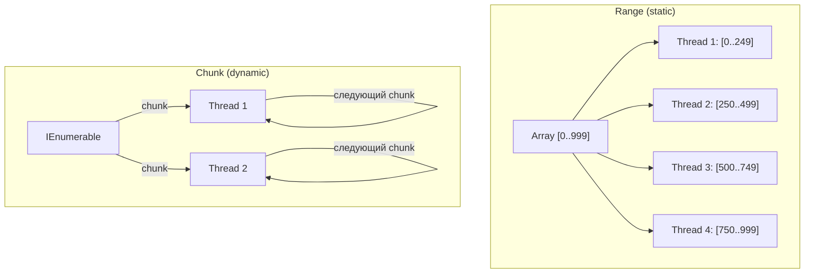

# Parallel.*

> Высокоуровневый API для CPU-bound параллелизма. Не создаёт Task на каждую итерацию — использует partitioning.

## Содержание
- [Parallel.For и Parallel.ForEach](#parallelfor-и-parallelforeach)
- [Thread-local state](#thread-local-state)
- [Обработка ошибок и досрочная остановка](#обработка-ошибок)
- [ParallelOptions](#paralleloptions)
- [Parallel.ForEachAsync](#parallelforeachasync)
- [Parallel.Invoke](#parallelinvoke)
- [Partitioning strategies](#partitioning-strategies)
- [Когда Parallel.* вреден](#когда-parallel-вреден)
- [Подводные камни](#подводные-камни)
- [См. также](#см-также)

---

## Parallel.For и Parallel.ForEach

**Как работает внутри:**
1. Диапазон/коллекция разбивается на **partitions**
2. Каждый partition обрабатывается одним потоком
3. **Вызывающий поток** тоже участвует в обработке — не ждёт в стороне
4. Метод **блокирует** вызывающий поток до завершения всех partitions

```csharp
// Parallel.For — числовой диапазон
var results = new double[10_000_000];
Parallel.For(0, results.Length, i =>
{
    results[i] = Math.Sqrt(i) * Math.Sin(i);
});
// Вызывающий поток заблокирован до завершения

// Parallel.ForEach — коллекция
Parallel.ForEach(orders, order =>
{
    var report = GenerateReport(order); // CPU-bound
    var hash = ComputeHash(report);     // CPU-bound
    StoreLocally(order.Id, hash);
});
```



---

## Thread-local state

Вместо блокировки на каждой итерации — накапливать результат локально на каждом потоке, слить в конце:

```csharp
long total = 0;

// ПЛОХО: Interlocked на каждой итерации — contention
Parallel.For(0, 1_000_000, i =>
{
    Interlocked.Add(ref total, Compute(i));
});

// ХОРОШО: thread-local accumulator
Parallel.For(
    fromInclusive: 0,
    toExclusive: 1_000_000,
    localInit: () => 0L,                        // начальное значение на поток
    body: (i, state, localSum) =>
    {
        return localSum + Compute(i);            // без синхронизации
    },
    localFinally: localSum =>
    {
        Interlocked.Add(ref total, localSum);    // один раз на поток
    });
```

---

## Обработка ошибок

Если итерация бросает исключение — Parallel не останавливается мгновенно. Дожидается текущих итераций, потом бросает `AggregateException`:

```csharp
try
{
    Parallel.ForEach(items, item =>
    {
        if (item.IsCorrupted)
            throw new InvalidOperationException($"Corrupted: {item.Id}");
        Process(item);
    });
}
catch (AggregateException ae)
{
    // Может содержать несколько исключений из разных потоков
    foreach (var ex in ae.InnerExceptions)
        logger.LogError(ex, "Parallel item failed");
}
```

**Досрочная остановка через ParallelLoopState:**

```csharp
// Stop() — немедленный сигнал остановки (итерации с большим индексом не начнутся)
Parallel.For(0, 1_000_000, (i, state) =>
{
    if (FoundAnswer(i))
    {
        state.Stop();
        return;
    }
    Process(i);
});

// Break() — гарантирует обработку всех итераций с индексом < текущего
Parallel.For(0, 1_000_000, (i, state) =>
{
    if (ShouldStop(i))
    {
        state.Break(); // все i < текущего будут обработаны
        return;
    }
    Process(i);
});
```

---

## ParallelOptions

```csharp
var options = new ParallelOptions
{
    MaxDegreeOfParallelism = Environment.ProcessorCount / 2,
    CancellationToken = cts.Token,
    TaskScheduler = TaskScheduler.Default
};

try
{
    Parallel.ForEach(collection, options, item => ProcessItem(item));
}
catch (OperationCanceledException)
{
    logger.LogWarning("Parallel processing cancelled");
}
```

| MaxDegreeOfParallelism | Когда |
|------------------------|-------|
| `-1` (default) | Чистый CPU-bound, нет других нагрузок |
| `ProcessorCount` | То же, явно |
| `ProcessorCount / 2` | CPU-bound + другие сервисы на том же сервере |
| Лимит ресурса | Ограниченный ресурс (например, 4 DB connections) |

---

## Parallel.ForEachAsync

**(.NET 6+)** Асинхронная версия. Делегат тела — `async`, метод возвращает `Task`. Не блокирует вызывающий поток.

Идеален для сценариев: каждая итерация содержит и CPU, и I/O работу.

```csharp
await Parallel.ForEachAsync(
    urls,
    new ParallelOptions { MaxDegreeOfParallelism = 10 },
    async (url, token) =>
    {
        var html = await httpClient.GetStringAsync(url, token); // I/O
        var parsed = Parse(html);           // CPU
        await SaveAsync(parsed, token);     // I/O
    });
```

**Внутри** создаётся `MaxDegreeOfParallelism` воркеров, каждый в цикле берёт следующий элемент и вызывает async-делегат.

**ForEachAsync vs ручной семафор:**

```csharp
// До .NET 6 — ручной SemaphoreSlim:
var semaphore = new SemaphoreSlim(10);
var tasks = urls.Select(async url =>
{
    await semaphore.WaitAsync(token);
    try { await ProcessAsync(url, token); }
    finally { semaphore.Release(); }
});
await Task.WhenAll(tasks);

// С .NET 6 — чище и безопаснее:
await Parallel.ForEachAsync(urls,
    new ParallelOptions { MaxDegreeOfParallelism = 10 },
    (url, token) => ProcessAsync(url, token));
```

---

## Parallel.Invoke

Запускает набор независимых делегатов параллельно. Самый простой способ — 2–10 операций:

```csharp
var report = new Report();

Parallel.Invoke(
    () => report.Revenue = CalculateRevenue(data),
    () => report.Expenses = CalculateExpenses(data),
    () => report.Forecast = BuildForecast(data),
    () => report.Risks = AnalyzeRisks(data)
);
// Все четыре метода завершились
```

Не поддерживает async-делегаты. Для async используй `Task.WhenAll`.

---

## Partitioning strategies

**Range Partitioning (статическое):** данные делятся на N равных диапазонов заранее.



- **Range:** минимальный overhead, нет балансировки. Хорошо когда все итерации одинаковы по времени.
- **Chunk:** синхронизация при взятии chunk'а, но автоматическая балансировка. Хорошо когда время варьируется.

```csharp
// Parallel.For с массивом → range partitioning (дефолт)
Parallel.For(0, array.Length, i => Process(array[i]));

// Parallel.ForEach с IEnumerable → chunk partitioning (дефолт)
Parallel.ForEach(GetItems(), item => Process(item));

// Принудительный range через Partitioner:
var rangePartitioner = Partitioner.Create(0, items.Count,
    items.Count / Environment.ProcessorCount);
Parallel.ForEach(rangePartitioner, range =>
{
    for (int i = range.Item1; i < range.Item2; i++)
        Process(items[i]);
});

// Принудительный chunk с балансировкой:
var chunkPartitioner = Partitioner.Create(items, loadBalance: true);
Parallel.ForEach(chunkPartitioner, item => Process(item));
```

---

## Когда Parallel.* вреден

**1. Мало данных — overhead > выигрыш:**

```csharp
// BAD: 10 элементов — overhead на scheduling > экономия
Parallel.ForEach(smallList, item => item.Name = item.Name.Trim());

// Эмпирика: Parallel.* оправдан если
// - итераций > 1000 при лёгкой работе
// - итераций > 10 при тяжёлой (>1ms на итерацию)
```

**2. I/O-bound работа — потоки заблокированы:**

```csharp
// BAD: thread starvation
Parallel.ForEach(urls, url =>
{
    var result = httpClient.GetStringAsync(url).Result; // BLOCKED
    Process(result);
});

// GOOD: async для I/O
await Parallel.ForEachAsync(urls,
    new ParallelOptions { MaxDegreeOfParallelism = 20 },
    async (url, token) => Process(await httpClient.GetStringAsync(url, token)));
```

**3. Вложенный параллелизм — thread explosion:**

```csharp
// BAD: 8 * 8 = 64 потока (и больше!)
Parallel.ForEach(categories, category =>
    Parallel.ForEach(category.Items, item => Process(item)));

// GOOD: параллелизм на одном уровне
Parallel.ForEach(categories.SelectMany(c => c.Items), item => Process(item));
```

**4. Работа под lock — сериализация:**

```csharp
// BAD: все потоки ждут lock → параллелизма нет
var results = new List<Result>();
Parallel.ForEach(items, item =>
{
    lock (results) { results.Add(Compute(item)); }
});

// GOOD: concurrent-коллекция
var results = new ConcurrentBag<Result>();
Parallel.ForEach(items, item => results.Add(Compute(item)));

// BEST: PLINQ
var results = items.AsParallel().Select(Compute).ToList();
```

---

## Подводные камни

**Parallel.For c `i++` на общем счётчике** — race condition. Используй `Interlocked.Increment` или thread-local state.

**`AggregateException` при отмене** — при передаче `CancellationToken` и отмене бросается `OperationCanceledException`, обёрнутый в `AggregateException`. Ловить нужно `OperationCanceledException`.

**`state.Stop()` не гарантирует остановку** — текущие итерации завершатся. Новые итерации с меньшим индексом могут успеть начаться до получения сигнала.

---

## См. также

- [01-concurrency-vs-parallelism.md](./01-concurrency-vs-parallelism.md) — когда Parallel.* нужен
- [04-plinq.md](./04-plinq.md) — PLINQ как альтернатива для запросов
- [06-partitioning.md](./06-partitioning.md) — Partitioner\<T\> детально
- [07-problems.md](./07-problems.md) — false sharing, starvation, overhead
