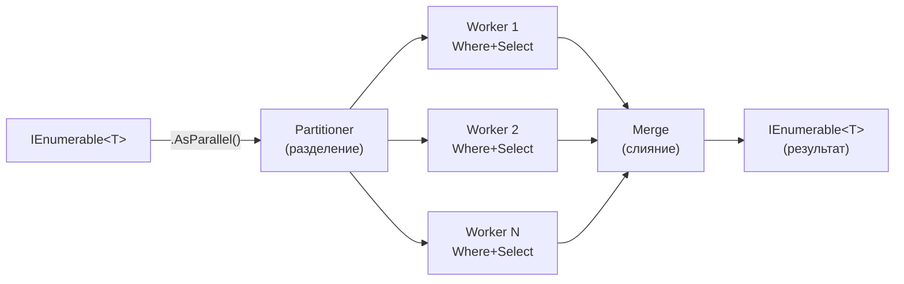
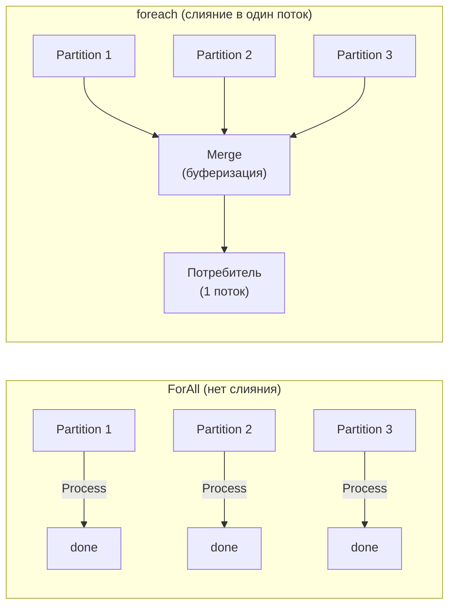

# PLINQ (Parallel LINQ)

> Добавь `.AsParallel()` — и LINQ-запрос выполнится на нескольких ядрах. Но это не серебряная пуля.

## Содержание
- [Как работает AsParallel](#как-работает-asparallel)
- [WithDegreeOfParallelism и WithCancellation](#withdegreeofparallelism)
- [AsOrdered / AsUnordered](#asordered--asunordered)
- [ForAll vs foreach](#forall-vs-foreach)
- [Merge options](#merge-options)
- [Когда PLINQ помогает и мешает](#когда-помогает-и-мешает)
- [Подводные камни](#подводные-камни)
- [См. также](#см-также)

---

## Как работает AsParallel

PLINQ разбивает источник данных на partitions, обрабатывает каждый partition на отдельном потоке, сливает результаты:



```csharp
// Базовый запрос
var primes = Enumerable.Range(2, 10_000_000)
    .AsParallel()
    .Where(n => IsPrime(n))   // фильтрация на нескольких потоках
    .Select(n => n * n)       // трансформация на нескольких потоках
    .ToList();                // слияние результатов
// На 4 ядрах ускорение ~3-4x для CPU-intensive IsPrime
```

**PLINQ может решить выполнить запрос последовательно** — если эвристика решит, что параллелизм не даст выигрыша. Это зависит от:
- Типа операторов (`TakeWhile`, `SkipWhile` плохо параллелятся)
- Типа источника (массив/`IList<T>` — хорошо, `IEnumerable<T>` — хуже)

```csharp
// Принудительный параллелизм — игнорирует эвристику:
var result = source
    .AsParallel()
    .WithExecutionMode(ParallelExecutionMode.ForceParallelism)
    .Where(x => ExpensiveFilter(x))
    .ToList();
```

---

## WithDegreeOfParallelism

```csharp
using var cts = new CancellationTokenSource(TimeSpan.FromSeconds(30));

var results = largeDataSet
    .AsParallel()
    .WithDegreeOfParallelism(4)          // максимум 4 потока
    .WithCancellation(cts.Token)          // поддержка отмены
    .Where(item => CpuIntensiveFilter(item))
    .Select(item => Transform(item))
    .ToList();
```

**WithDegreeOfParallelism:**
- По умолчанию = `Environment.ProcessorCount`
- Максимум = 512
- Устанавливает **верхнюю границу** — PLINQ может использовать меньше
- Полезно для ограничения CPU usage на многоядерных серверах

---

## AsOrdered / AsUnordered

По умолчанию `AsParallel()` **не гарантирует** порядок результатов — элементы появляются в порядке завершения потоков.

```csharp
// Без AsOrdered — порядок не определён
var unordered = Enumerable.Range(0, 100)
    .AsParallel()
    .Where(n => n % 2 == 0)
    .ToList();
// Может быть: [0, 50, 2, 52, 4, 54, ...]

// AsOrdered — порядок сохранён (ценой производительности)
var ordered = Enumerable.Range(0, 100)
    .AsParallel()
    .AsOrdered()
    .Where(n => n % 2 == 0)
    .ToList();
// Всегда: [0, 2, 4, 6, 8, ...]

// AsUnordered — снять ограничение после AsOrdered
var mixed = source
    .AsParallel()
    .AsOrdered()
    .Where(x => Filter(x))              // здесь порядок сохранён
    .AsUnordered()                       // дальше порядок не важен
    .Select(x => ExpensiveTransform(x))  // без сортировки — быстрее
    .ToList();
```

**Стоимость AsOrdered:** PLINQ буферизует результаты и сортирует по исходному индексу. Дополнительная память + CPU. Используй только когда порядок действительно важен.

---

## ForAll vs foreach

**ForAll** — параллельное потребление, без слияния в один поток.  
**foreach** — последовательное потребление после слияния.



```csharp
// ForAll — выполняется на разных потоках параллельно, нет merge overhead
source.AsParallel()
    .Where(x => Filter(x))
    .ForAll(x =>
    {
        // Выполняется параллельно
        // Нельзя писать в List<T> или другие non-thread-safe структуры
        concurrentBag.Add(Process(x));
    });

// foreach — потребление на вызывающем потоке, PLINQ сливает результаты
foreach (var x in source.AsParallel().Where(x => Filter(x)))
{
    // Один поток. PLINQ должен слить результаты → overhead
    Process(x);
}
```

**Когда что:**
- `ForAll` — side-effect (запись в `ConcurrentBag`, отправка сообщений), порядок не важен
- `foreach`/`ToList`/`ToArray` — нужен результат в определённом порядке или на одном потоке

---

## Merge options

Режим слияния результатов из параллельных потоков в выходной `IEnumerable<T>`:

| Режим | Поведение | Первый элемент | Память |
|-------|-----------|----------------|--------|
| `AutoBuffered` (default) | Буфер средней глубины, порциями | Средне | Средне |
| `NotBuffered` | Элементы выдаются по одному как готовы | Быстро | Мало |
| `FullyBuffered` | Всё собирается, потом выдаётся | Медленно | Много |

```csharp
// NotBuffered — первый элемент появляется максимально быстро
foreach (var item in source
    .AsParallel()
    .WithMergeOptions(ParallelMergeOptions.NotBuffered)
    .Select(x => SlowTransform(x)))
{
    Console.WriteLine(item); // не дожидается остальных
}

// FullyBuffered — нужен для OrderBy и других операторов
var sorted = source
    .AsParallel()
    .WithMergeOptions(ParallelMergeOptions.FullyBuffered)
    .OrderBy(x => x.Score)
    .ToList();
```

---

## Когда помогает и мешает

**Помогает:**
- CPU-bound трансформация большой коллекции (>10 000 элементов)
- Тяжёлые вычисления на каждый элемент (>1 мс)
- Агрегации: `Sum`, `Average`, `Aggregate`
- Поиск с тяжёлым предикатом: `Any`, `First`

**Мешает:**
- Мало данных — overhead на partitioning + merge > выигрыш
- Лёгкие операции — `ToUpper`, `+1` — overhead координации доминирует
- Зависимости между элементами
- I/O-bound — блокирует потоки

```csharp
// ХОРОШО: тяжёлый CPU-bound на большом наборе
var primes = Enumerable.Range(2, 10_000_000)
    .AsParallel()
    .Where(IsPrime)     // CPU-intensive
    .ToList();
// Ускорение ~3-4x на 4 ядрах

// ПЛОХО: лёгкая операция — медленнее обычного LINQ!
var upper = names
    .AsParallel()
    .Select(n => n.ToUpper())
    .ToList();
```

**Полная форма PLINQ Aggregate (MapReduce):**

```csharp
var result = logEntries
    .AsParallel()
    .Aggregate(
        // seedFactory: начальное значение на каждый поток
        () => new Dictionary<string, int>(),

        // updateAccumulatorFunc: локальная аккумуляция (MAP + частичный REDUCE)
        (localDict, entry) =>
        {
            localDict.TryGetValue(entry.Level, out var count);
            localDict[entry.Level] = count + 1;
            return localDict;
        },

        // combineAccumulatorsFunc: слияние thread-local результатов (REDUCE)
        (dict1, dict2) =>
        {
            foreach (var (key, value) in dict2)
            {
                dict1.TryGetValue(key, out var count);
                dict1[key] = count + value;
            }
            return dict1;
        },

        // resultSelector: финальная трансформация
        finalDict => finalDict);
// {"INFO": 45230, "WARN": 1203, "ERROR": 87}
```

---

## Подводные камни

**`OrderBy` + `AsOrdered` — двойная сортировка.** `AsOrdered` сохраняет исходный порядок, `OrderBy` сортирует. Если обе применены — лишняя работа. Выбирай что-то одно.

**`GroupBy` в PLINQ** — не дружит с параллелизмом. PLINQ частично переходит на sequential mode. Если группировка — ключевая операция, PLINQ может не ускорить.

**Исключения — всегда `AggregateException`.** Даже `OperationCanceledException` при отмене оборачивается. Ловить через `ae.Flatten().InnerExceptions`.

**Мутация источника во время итерации** — undefined behavior. PLINQ читает источник с нескольких потоков, любая мутация — race condition.

---

## См. также

- [03-parallel.md](./03-parallel.md) — Parallel.ForEach как альтернатива для итераций
- [06-partitioning.md](./06-partitioning.md) — как PLINQ разделяет данные на partitions
- [07-problems.md](./07-problems.md) — overhead параллелизма: когда PLINQ делает хуже
