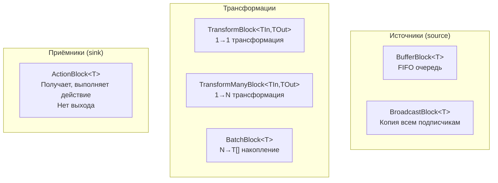
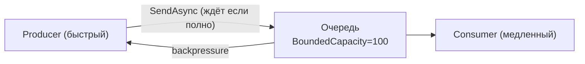
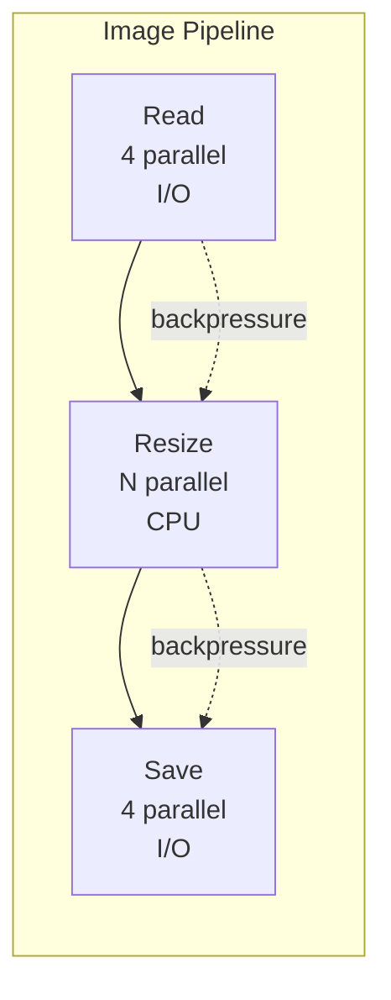

# TPL Dataflow

> Библиотека для построения конвейеров обработки данных. Каждый блок — отдельный actor с очередью, параллелизмом и backpressure.

## Содержание
- [Что такое Dataflow](#что-такое-dataflow)
- [Основные блоки](#основные-блоки)
- [Linking blocks и PropagateCompletion](#linking-blocks)
- [BoundedCapacity — backpressure](#boundedcapacity)
- [Маршрутизация через предикаты](#маршрутизация)
- [Pipeline паттерн](#pipeline-паттерн)
- [Dataflow vs Channels vs Parallel.*](#dataflow-vs-channels-vs-parallel)
- [Подводные камни](#подводные-камни)
- [См. также](#см-также)

---

## Что такое Dataflow

`System.Threading.Tasks.Dataflow` (NuGet: `System.Threading.Tasks.Dataflow`) — набор **блоков**, каждый из которых:
- Имеет входную и/или выходную очередь
- Обрабатывает сообщения конкурентно (настраиваемый `MaxDegreeOfParallelism`)
- Поддерживает backpressure через `BoundedCapacity`
- Распространяет completion по цепочке

Подходит для **сложных конвейеров** с ветвлением, маршрутизацией и batching. Для простого producer/consumer предпочти `Channel<T>`.

---

## Основные блоки



**ActionBlock — конечная точка:**

```csharp
var printer = new ActionBlock<string>(
    message => Console.WriteLine($"[{DateTime.UtcNow:HH:mm:ss}] {message}"),
    new ExecutionDataflowBlockOptions
    {
        MaxDegreeOfParallelism = 1 // последовательная обработка
    });

await printer.SendAsync("Hello");
await printer.SendAsync("World");
printer.Complete();
await printer.Completion; // дождаться завершения
```

**TransformBlock — преобразование:**

```csharp
var downloader = new TransformBlock<string, string>(
    async url =>
    {
        using var client = new HttpClient();
        return await client.GetStringAsync(url);
    },
    new ExecutionDataflowBlockOptions
    {
        MaxDegreeOfParallelism = 4 // до 4 параллельных загрузок
    });

// TransformManyBlock — один вход → несколько выходов
var splitter = new TransformManyBlock<string, string>(
    html => ExtractLinks(html)); // из страницы → список ссылок
```

**BatchBlock — накопление:**

```csharp
var batcher = new BatchBlock<LogEntry>(batchSize: 50);

// Принимает LogEntry по одному
await batcher.SendAsync(new LogEntry { Level = "INFO", Message = "Started" });
// Когда накопит 50 → выдаёт LogEntry[] из 50 элементов
// При Complete() → выдаёт последний неполный batch
```

**BroadcastBlock — рассылка всем:**

```csharp
var broadcast = new BroadcastBlock<PriceUpdate>(
    update => update with { } // функция клонирования
);
// Каждый подписчик получит копию каждого сообщения
// В отличие от BufferBlock, сообщение не удаляется после первого читателя
```

---

## Linking blocks

Связывание выхода одного блока со входом другого — данные автоматически перетекают:

```csharp
var downloader = new TransformBlock<string, string>(
    async url => await httpClient.GetStringAsync(url),
    new ExecutionDataflowBlockOptions { MaxDegreeOfParallelism = 8 });

var parser = new TransformBlock<string, ParsedData>(
    html => ParseHtml(html),
    new ExecutionDataflowBlockOptions { MaxDegreeOfParallelism = 4 });

var saver = new ActionBlock<ParsedData>(
    async data => await repository.SaveAsync(data),
    new ExecutionDataflowBlockOptions { MaxDegreeOfParallelism = 2 });

// Связываем: downloader → parser → saver
// PropagateCompletion: Complete() на источнике передастся дальше по цепочке
downloader.LinkTo(parser, new DataflowLinkOptions { PropagateCompletion = true });
parser.LinkTo(saver, new DataflowLinkOptions { PropagateCompletion = true });

// Отправляем данные
foreach (var url in urls)
    await downloader.SendAsync(url);

downloader.Complete();       // сигнал: данных больше не будет
await saver.Completion;      // ждём завершения всего конвейера
```

**`PropagateCompletion = true`** — обязателен для цепочек. Без него каждый блок нужно завершать вручную.

---

## BoundedCapacity

Ограничение размера входной очереди. Когда очередь заполнена — `SendAsync` **ждёт**, пока не освободится место. Это backpressure: медленный consumer автоматически тормозит быстрого producer.



```csharp
// Без BoundedCapacity — неограниченный рост памяти при медленном consumer
var unbounded = new ActionBlock<byte[]>(data => SlowProcess(data));

// С BoundedCapacity — producer блокируется при полной очереди
var bounded = new ActionBlock<byte[]>(
    data => SlowProcess(data),
    new ExecutionDataflowBlockOptions
    {
        BoundedCapacity = 100,
        MaxDegreeOfParallelism = 2
    });

foreach (var chunk in ReadLargeFile("data.bin"))
{
    // Если очередь полна — ждём, пока consumer обработает элементы
    await bounded.SendAsync(chunk);
}
```

---

## Маршрутизация

`LinkTo` принимает предикат — маршрутизация данных по условию:

```csharp
var classifier = new TransformBlock<Order, Order>(order =>
{
    order.Priority = CalculatePriority(order);
    return order;
});

var highPriority = new ActionBlock<Order>(order => ProcessUrgent(order));
var normalPriority = new ActionBlock<Order>(order => ProcessNormal(order));

// Маршрутизация по условию
classifier.LinkTo(highPriority,
    new DataflowLinkOptions { PropagateCompletion = true },
    order => order.Priority > 8);

classifier.LinkTo(normalPriority,
    new DataflowLinkOptions { PropagateCompletion = true },
    order => order.Priority > 0);

// Fallback обязателен — без него classifier застрянет если ни один предикат не сработал
classifier.LinkTo(DataflowBlock.NullTarget<Order>()); // /dev/null
```

---

## Pipeline паттерн

Конвейер обработки изображений: чтение → resize → фильтр → сохранение. Каждый этап работает параллельно с другими.

```csharp
public ITargetBlock<string> BuildImagePipeline(string outputDir, CancellationToken token)
{
    var linkOptions = new DataflowLinkOptions { PropagateCompletion = true };

    // Stage 1: Read (I/O-bound)
    var reader = new TransformBlock<string, (string Path, byte[] Bytes)>(
        async path => (path, await File.ReadAllBytesAsync(path, token)),
        new ExecutionDataflowBlockOptions
        {
            MaxDegreeOfParallelism = 4,
            BoundedCapacity = 10
        });

    // Stage 2: Resize (CPU-bound — больше потоков)
    var resizer = new TransformBlock<(string, byte[]), (string, byte[])>(
        data => (data.Item1, Resize(data.Item2, 1920, 1080)),
        new ExecutionDataflowBlockOptions
        {
            MaxDegreeOfParallelism = Environment.ProcessorCount,
            BoundedCapacity = 5
        });

    // Stage 3: Save (I/O-bound)
    var saver = new ActionBlock<(string Path, byte[] Bytes)>(
        async data =>
        {
            var dest = Path.Combine(outputDir, Path.GetFileName(data.Path));
            await File.WriteAllBytesAsync(dest, data.Bytes, token);
        },
        new ExecutionDataflowBlockOptions
        {
            MaxDegreeOfParallelism = 4,
            BoundedCapacity = 10
        });

    reader.LinkTo(resizer, linkOptions);
    resizer.LinkTo(saver, linkOptions);

    return reader; // caller постит в reader, ждёт saver.Completion
}
```



Каждый этап независимо настраивается: `MaxDegreeOfParallelism` под тип работы, `BoundedCapacity` под скорость следующего этапа.

---

## Dataflow vs Channels vs Parallel.*

| Критерий | TPL Dataflow | Channel\<T\> | Parallel.* |
|----------|-------------|-------------|-----------|
| **Модель** | Граф блоков | Точка-точка | Fork/Join |
| **Сложные графы** | Да (LinkTo, фильтры) | Нет (вручную) | Нет |
| **Backpressure** | BoundedCapacity | BoundedCapacity | Нет |
| **Async** | Да | Да | ForEachAsync |
| **NuGet** | Отдельный пакет | Встроен (.NET 5+) | Встроен |
| **Overhead** | Средний | Низкий | Низкий |

**Правило выбора:**
- `Parallel.*` — одна коллекция, CPU-bound, нужен результат сразу
- `Channel<T>` — простой producer/consumer, стриминг
- `Dataflow` — сложный конвейер, ветвления, batching, маршрутизация

---

## Подводные камни

**Не вызвал `Complete()`** — конвейер никогда не завершится, `await block.Completion` будет ждать вечно.

**Нет fallback-LinktTo** — если у classifier нет `NullTarget` и пришёл элемент, не прошедший ни один предикат — он застрянет в буфере и заблокирует весь pipeline.

**`PropagateCompletion` и исключения** — при ошибке в блоке он переходит в faulted-состояние. `PropagateCompletion = true` распространяет **и ошибки** тоже. Иногда нужно проверять `block.Completion.IsFaulted` явно.

**Не ждёшь `Completion` последнего блока** — данные могут быть не сохранены при завершении программы. Всегда `await lastBlock.Completion`.

---

## См. также

- [03-parallel.md](./03-parallel.md) — Parallel.ForEach как более простая альтернатива
- [08-patterns.md](./08-patterns.md) — Pipeline через Channels (более лёгковесный подход)
