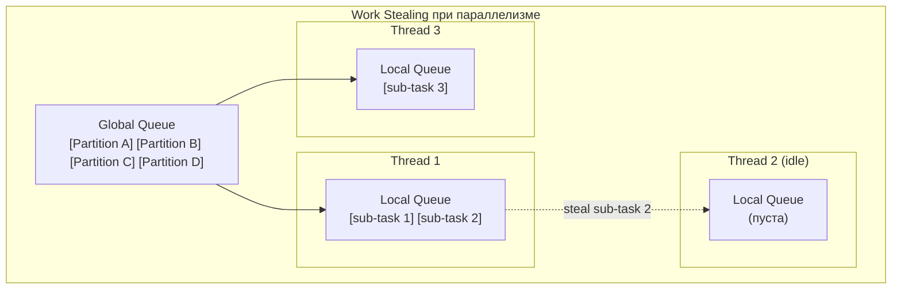
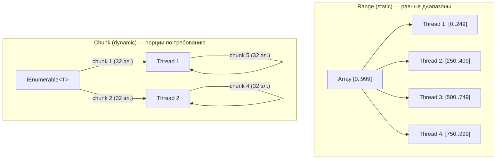

# Partitioning и Work Stealing

> Правильное разделение данных между потоками — разница между 4x ускорением и деградацией производительности.

## Содержание
- [Как ThreadPool распределяет работу при параллелизме](#как-threadpool-распределяет-работу)
- [Range Partitioning vs Chunk Partitioning](#range-vs-chunk)
- [Partitioner\<T\>: встроенные варианты](#partitionert-встроенные-варианты)
- [Кастомный Partitioner](#кастомный-partitioner)
- [Static vs Dynamic load balancing](#static-vs-dynamic)
- [Подводные камни](#подводные-камни)
- [См. также](#см-также)

---

## Как ThreadPool распределяет работу

ThreadPool использует двухуровневую очередь и work stealing. В контексте параллелизма это означает:

1. `Parallel.For` разбивает диапазон на partitions и кладёт их в **глобальную очередь**
2. Worker-потоки забирают partitions и могут порождать sub-tasks в **локальные очереди**
3. **Work Stealing** — поток, закончивший свою работу, ворует sub-tasks из локальных очередей **других** потоков (с противоположного конца deque)



**Hill Climbing** медленно добавляет потоки (~1 в 500 мс). Если `Parallel.For` запросит 8 потоков, а в пуле только 4 — первые секунды будет работать на 4. Это важно для коротких задач: они могут завершиться раньше, чем пул успеет масштабироваться.

---

## Range vs Chunk

**Range Partitioning (статическое):** коллекция делится на N равных диапазонов **заранее** — один на поток.



| | Range (static) | Chunk (dynamic) |
|--|----------------|-----------------|
| **Overhead** | Минимальный | Синхронизация при взятии chunk'а |
| **Балансировка** | Нет — фиксированный объём | Да — быстрые потоки берут больше |
| **Когда лучше** | Одинаковое время на элемент | Разное время на элемент |
| **Источник** | Массив, `IList<T>` | `IEnumerable<T>` |
| **Пример** | Матричные вычисления | Парсинг файлов разного размера |

**Автоматический выбор в Parallel.*:**
- `Parallel.For(0, n, ...)` с массивом → range partitioning
- `Parallel.ForEach(IEnumerable, ...)` → chunk partitioning

---

## Partitioner\<T\>: встроенные варианты

```csharp
// 1. Range partitioner для индексного доступа
var rangePartitioner = Partitioner.Create(0, array.Length);
Parallel.ForEach(rangePartitioner, (range, state) =>
{
    for (int i = range.Item1; i < range.Item2; i++)
        Process(array[i]);
});

// 2. Range partitioner с явным размером chunk'а
var customRange = Partitioner.Create(0, data.Length, chunkSize: 1000);
Parallel.ForEach(customRange, range =>
{
    for (int i = range.Item1; i < range.Item2; i++)
        Transform(data[i]);
});

// 3. Chunk partitioner с балансировкой нагрузки
var loadBalanced = Partitioner.Create(items, loadBalance: true);
Parallel.ForEach(loadBalanced, item => Process(item));

// 4. PLINQ — Partitioner.Create для параллельного запроса
var result = Partitioner.Create(bigArray, loadBalance: false)
    .AsParallel()
    .Select(item => Transform(item))
    .ToList();
```

---

## Кастомный Partitioner

Нужен когда встроенные стратегии не подходят — например, все элементы одного ключа должны обрабатываться одним потоком:

```csharp
/// <summary>
/// Partitioner that groups items by key so that all items with
/// the same key are processed on the same thread.
/// Avoids concurrent access to per-key shared state.
/// </summary>
public class KeyGroupPartitioner<TKey, TValue> : Partitioner<TValue>
    where TKey : notnull
{
    private readonly IReadOnlyList<TValue> _source;
    private readonly Func<TValue, TKey> _selector;

    public KeyGroupPartitioner(
        IReadOnlyList<TValue> source,
        Func<TValue, TKey> selector)
    {
        _source = source;
        _selector = selector;
    }

    public override bool SupportsDynamicPartitions => false;

    public override IList<IEnumerator<TValue>> GetPartitions(int partitionCount)
    {
        // Группируем по ключу
        var groups = _source.GroupBy(_selector).ToList();

        // Распределяем группы по партициям round-robin
        var partitions = Enumerable.Range(0, partitionCount)
            .Select(_ => new List<TValue>())
            .ToList();

        for (int i = 0; i < groups.Count; i++)
            partitions[i % partitionCount].AddRange(groups[i]);

        return partitions
            .Select(p => p.GetEnumerator())
            .ToList<IEnumerator<TValue>>();
    }
}

// Все заказы одного клиента обрабатываются на одном потоке
var partitioner = new KeyGroupPartitioner<string, Order>(
    orders, o => o.CustomerId);

Parallel.ForEach(partitioner, order =>
{
    // Нет race condition: один клиент = один поток
    UpdateCustomerBalance(order);
});
```

---

## Static vs Dynamic

```csharp
// Static: хорошо для однородной работы
// Каждый поток получает 1/N данных, нет overhead на координацию
var staticPart = Partitioner.Create(0, matrix.Length);
Parallel.ForEach(staticPart, range =>
{
    for (int i = range.Item1; i < range.Item2; i++)
        matrix[i] = Math.Sqrt(matrix[i]); // одинаковое время
});

// Dynamic: хорошо для неоднородной работы
// Быстрые потоки берут больше chunk'ов
var dynamicPart = Partitioner.Create(files, loadBalance: true);
Parallel.ForEach(dynamicPart, file =>
{
    ParseFile(file); // файлы разного размера → разное время
});
```

**Размер chunk'а в dynamic partitioning** — компромисс:
- Маленький chunk → хорошая балансировка, много синхронизации
- Большой chunk → мало синхронизации, плохая балансировка при неравномерной нагрузке

.NET по умолчанию использует **adaptive chunk sizing**: начинает с малого chunk'а, увеличивает до 512.

---

## Подводные камни

**Слишком маленький chunk** — при `chunkSize = 1` каждый поток синхронизируется на каждом элементе. Overhead доминирует. Минимальный разумный размер — 16–64 элемента.

**Range partitioning с `IEnumerable`** — невозможен. `IEnumerable` не поддерживает произвольный доступ по индексу. PLINQ/Parallel автоматически переключатся на chunk.

**`SupportsDynamicPartitions = false` в кастомном Partitioner** — если `true`, PLINQ будет запрашивать дополнительные partitions по мере обработки. Если `false` — только один вызов `GetPartitions`. Для статических структур данных — `false` достаточно.

---

## См. также

- [03-parallel.md](./03-parallel.md) — как Parallel.* использует Partitioner
- [04-plinq.md](./04-plinq.md) — Partitioner в PLINQ
- [07-problems.md](./07-problems.md) — false sharing: другой тип проблемы с распределением данных
