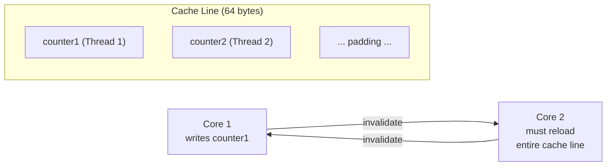
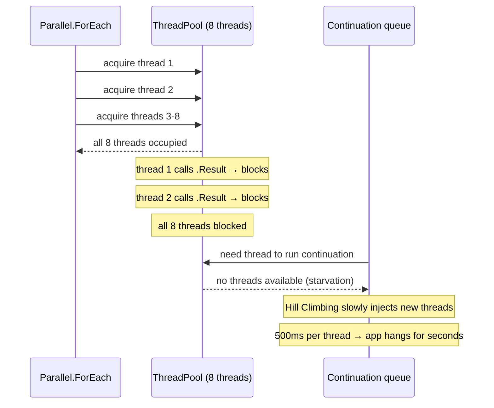
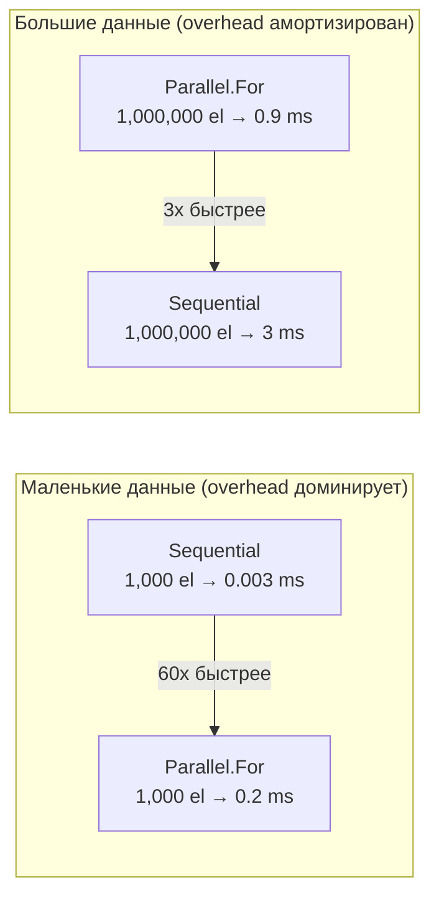
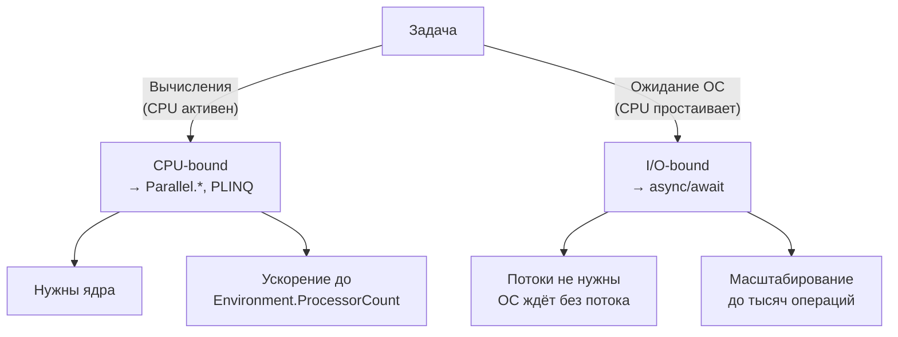

# Проблемы параллелизма

> False sharing, thread starvation и overhead — три причины, почему параллельный код может быть медленнее однопоточного.

## Содержание
- [False Sharing](#false-sharing)
- [Thread Starvation при смешивании sync и async](#thread-starvation)
- [Overhead параллелизма](#overhead-параллелизма)
- [Правило: CPU-bound vs I/O-bound](#правило-cpu-vs-io)
- [Подводные камни](#подводные-камни)
- [См. также](#см-также)

---

## False Sharing

**False sharing** — ситуация, когда два потока модифицируют **разные** переменные, которые оказались на **одной кеш-линии** процессора (обычно 64 байта). Процессор инвалидирует кеш-линию целиком при каждой записи, даже если потоки не конкурируют за одни данные.

**Как работает кеш CPU:**

CPU работает не с отдельными байтами, а с кеш-линиями. Протокол MESI/MOESI: когда поток записывает в кеш-линию, все копии этой линии в кешах других ядер инвалидируются. Оба потока вынуждены перечитывать данные из L3 или RAM.



```csharp
// False sharing — ПЛОХОЙ пример
// long = 8 bytes → counters[0] и counters[1] на одной кеш-линии (64 bytes)
var counters = new long[Environment.ProcessorCount];

Parallel.For(0, Environment.ProcessorCount, i =>
{
    for (int j = 0; j < 100_000_000; j++)
        counters[i]++; // Все ядра инвалидируют друг друга!
});
// На 8 ядрах может быть МЕДЛЕННЕЕ, чем на одном

// Исправление: padding — разнести counter'ы по разным кеш-линиям
// 8 longs = 64 bytes = одна кеш-линия → каждый counter на своей линии
var paddedCounters = new long[Environment.ProcessorCount * 8];

Parallel.For(0, Environment.ProcessorCount, i =>
{
    int index = i * 8; // stride = 64 bytes
    for (int j = 0; j < 100_000_000; j++)
        paddedCounters[index]++;
});
```

Правильное решение — использовать thread-local state из `Parallel.For`, тогда padding не нужен:

```csharp
long total = 0;

Parallel.For(
    fromInclusive: 0,
    toExclusive: 100_000_000,
    localInit: () => 0L,
    body: (i, state, localSum) => localSum + Compute(i),
    localFinally: localSum => Interlocked.Add(ref total, localSum));
// Один Interlocked на поток вместо одного на итерацию
```

**Как обнаружить:**
- **Windows:** ETW / perfmon → `Last Level Cache Misses` при параллельной работе значительно выше, чем при однопоточной
- **Linux:** `perf stat -e cache-misses`
- **BenchmarkDotNet:** сравнить throughput с padding и без — разница в 5–10x указывает на false sharing

---

## Thread Starvation

**Сценарий:** код использует `Parallel.*` (занимает потоки пула) и одновременно вызывает `.Result` / `.Wait()` внутри тела (блокирует эти потоки). ThreadPool исчерпывается, continuation'ы не могут выполниться → deadlock или starvation.



```csharp
// КАТАСТРОФА: Parallel + sync-over-async
Parallel.ForEach(urls, url =>
{
    // Каждая итерация блокирует поток пула на время HTTP-запроса
    var html = httpClient.GetStringAsync(url).Result; // BLOCKED!
    Process(html);
});
// При 1000 URL и 8 ядрах:
// 1. Parallel.ForEach берёт ~8 потоков из пула
// 2. Все 8 заблокированы на .Result
// 3. Continuation'ы от GetStringAsync стоят в очереди ThreadPool
// 4. Некому их выполнить → Hill Climbing медленно инжектирует потоки
// 5. Новые потоки тоже блокируются → лавина
// 6. Приложение «зависает» на десятки секунд

// ПРАВИЛЬНО: async-итерация для I/O-bound
await Parallel.ForEachAsync(urls,
    new ParallelOptions { MaxDegreeOfParallelism = 20 },
    async (url, token) =>
    {
        var html = await httpClient.GetStringAsync(url, token); // не блокирует
        Process(html);
    });
```

---

## Overhead параллелизма

**Что стоит параллелизм:**

| Компонент | Стоимость |
|-----------|-----------|
| Создание Task | ~200 bytes аллокации, scheduling overhead |
| Partitioning | Разделение данных, создание Partitioner |
| Синхронизация | lock / Interlocked / CAS на общие структуры |
| Context switch | ~1–10 мкс на переключение потока |
| Cache invalidation | При доступе к общим данным |
| Merge | Слияние результатов из разных потоков |



```csharp
// Параллелизм оправдан, когда суммарная работа >> overhead
// Эмпирика:
// - Тело итерации: > 1 мкс
// - Количество итераций: > 1000 при лёгкой работе, > 10 при тяжёлой (>1 мс/итерацию)

// TOO SMALL: overhead > выигрыш
Parallel.ForEach(smallList10, item => item.Name = item.Name.Trim());

// OK: достаточно итераций с тяжёлой работой
Parallel.ForEach(documents1000, doc =>
{
    doc.Hash = ComputeSha256(doc.Content); // ~1 мс на документ
});

// GREAT: много итераций с тяжёлой работой
Parallel.For(0, 10_000_000, i => matrix[i] = HeavyCompute(i));
```

---

## Правило: CPU vs I/O



| | CPU-bound | I/O-bound |
|--|-----------|-----------|
| **Инструмент** | `Parallel.*`, PLINQ | `async/await` |
| **Почему** | Нужны ядра для вычислений | Потоки не нужны — ОС ждёт |
| **Потоки** | Заняты полезной работой | Не должны быть заняты |
| **Масштабирование** | До числа ядер | До тысяч операций |
| **Пример** | Парсинг, хеширование, рендеринг | HTTP, DB, файлы, очереди |

**Правильное сочетание: async для I/O, Parallel для CPU:**

```csharp
async Task ProcessBatch(IReadOnlyList<string> urls, CancellationToken token)
{
    // Шаг 1: загрузить данные — I/O-bound → async
    var pages = await Task.WhenAll(
        urls.Select(url => httpClient.GetStringAsync(url, token)));

    // Шаг 2: обработать данные — CPU-bound → Parallel
    var results = new ConcurrentBag<AnalysisResult>();
    Parallel.ForEach(pages, html =>
    {
        var parsed = Parse(html);       // CPU
        var analyzed = Analyze(parsed); // CPU
        results.Add(analyzed);
    });

    // Шаг 3: сохранить — I/O-bound → async
    foreach (var result in results)
        await repository.SaveAsync(result, token);
}
```

**Смешанная работа (CPU + I/O в одной итерации) → `Parallel.ForEachAsync`:**

```csharp
await Parallel.ForEachAsync(items,
    new ParallelOptions { MaxDegreeOfParallelism = 10 },
    async (item, token) =>
    {
        var raw = await storageClient.DownloadAsync(item.Url, token); // I/O
        var processed = HeavyTransform(raw);                           // CPU
        await database.SaveAsync(processed, token);                    // I/O
    });
```

---

## Подводные камни

**Вложенный параллелизм** — thread explosion. Outer × inner = N² потоков:

```csharp
// BAD: 8 * 8 = 64+ потока
Parallel.ForEach(categories, category =>
    Parallel.ForEach(category.Items, item => Process(item)));

// GOOD: параллелизм на одном уровне
Parallel.ForEach(categories.SelectMany(c => c.Items), item => Process(item));
```

**Работа под lock** — сериализует весь параллелизм:

```csharp
// BAD: все потоки сериализованы на lock
var results = new List<Result>();
Parallel.ForEach(items, item =>
{
    lock (results) { results.Add(Compute(item)); }
});

// GOOD: concurrent-коллекция без lock
var results = new ConcurrentBag<Result>();
Parallel.ForEach(items, item => results.Add(Compute(item)));

// BEST: PLINQ — нет мутации общего состояния
var results = items.AsParallel().Select(Compute).ToList();
```

**Слишком маленький MaxDegreeOfParallelism** для I/O:

```csharp
// BAD: 2 потока для I/O — ядра простаивают, операции ждут
await Parallel.ForEachAsync(apiRequests,
    new ParallelOptions { MaxDegreeOfParallelism = 2 },
    async (req, token) => await apiClient.CallAsync(req, token));

// GOOD: I/O не привязан к ядрам — используй 10-50
await Parallel.ForEachAsync(apiRequests,
    new ParallelOptions { MaxDegreeOfParallelism = 20 },
    async (req, token) => await apiClient.CallAsync(req, token));
```

---

## См. также

- [03-parallel.md](./03-parallel.md) — Parallel.ForEachAsync для смешанной работы
- [06-partitioning.md](./06-partitioning.md) — false sharing через неправильное partitioning
- [08-patterns.md](./08-patterns.md) — паттерны для избегания starvation и overhead
