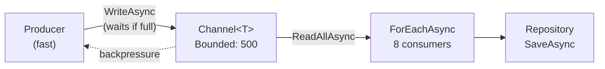
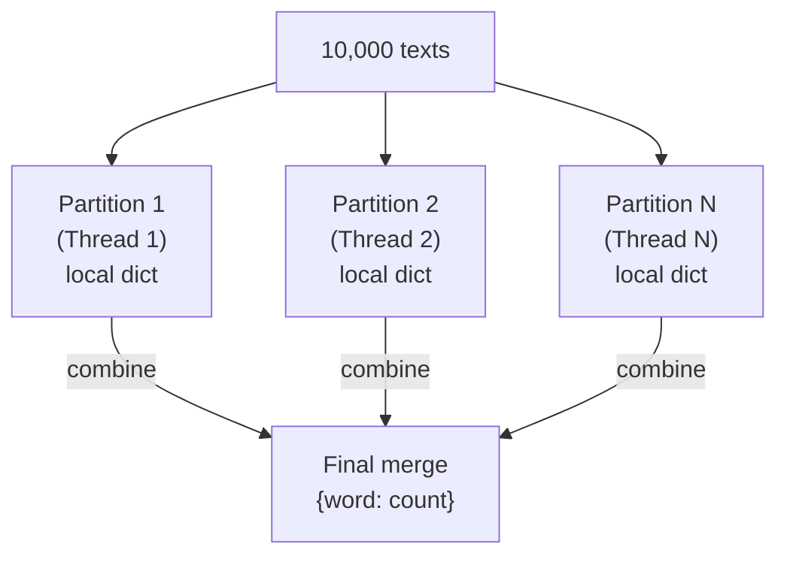
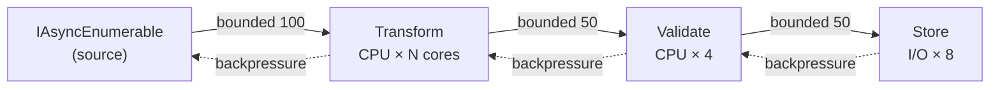

# Практические паттерны параллелизма

> Producer/Consumer с backpressure, MapReduce, многостадийный pipeline — готовые решения для реальных задач.

## Содержание
- [Producer/Consumer с throttling](#producerconsumer)
- [MapReduce через PLINQ](#mapreduce)
- [Pipeline через Channels](#pipeline)
- [Batch + Parallel](#batch--parallel)
- [Шпаргалка: выбор инструмента](#шпаргалка)
- [См. также](#см-также)

---

## Producer/Consumer

**Задача:** producer генерирует данные быстрее, чем consumer обрабатывает. Нужен bounded буфер для backpressure и несколько consumer'ов для параллельной обработки.



```csharp
/// <summary>
/// Bounded producer/consumer with configurable parallelism.
/// Uses Channel for backpressure and Parallel.ForEachAsync for consumption.
/// </summary>
public class BoundedProcessor<T>
{
    private readonly Channel<T> _channel;
    private readonly int _parallelism;

    public BoundedProcessor(int capacity, int parallelism)
    {
        _channel = Channel.CreateBounded<T>(new BoundedChannelOptions(capacity)
        {
            FullMode = BoundedChannelFullMode.Wait,
            SingleWriter = false,
            SingleReader = false
        });
        _parallelism = parallelism;
    }

    /// <summary>
    /// Enqueues item. Awaits if buffer is full (backpressure).
    /// </summary>
    public ValueTask Enqueue(T item, CancellationToken token = default)
        => _channel.Writer.WriteAsync(item, token);

    /// <summary>
    /// Signals that no more items will be enqueued.
    /// </summary>
    public void Complete() => _channel.Writer.Complete();

    /// <summary>
    /// Starts consuming items with bounded parallelism.
    /// Returns when all items are processed and Complete() was called.
    /// </summary>
    public async Task Consume(
        Func<T, CancellationToken, ValueTask> handler,
        CancellationToken token = default)
    {
        await Parallel.ForEachAsync(
            _channel.Reader.ReadAllAsync(token),
            new ParallelOptions
            {
                MaxDegreeOfParallelism = _parallelism,
                CancellationToken = token
            },
            async (item, ct) => await handler(item, ct));
    }
}

// Использование
var processor = new BoundedProcessor<Order>(capacity: 500, parallelism: 8);

var producing = Task.Run(async () =>
{
    await foreach (var order in orderStream.ReadAllAsync())
    {
        await processor.Enqueue(order); // backpressure если буфер полон
    }
    processor.Complete();
});

var consuming = processor.Consume(async (order, token) =>
{
    var validated = Validate(order);              // CPU
    await repository.SaveAsync(validated, token); // I/O
}, cancellationToken);

await Task.WhenAll(producing, consuming);
```

**Почему не `SemaphoreSlim + Task.WhenAll`:** при таком подходе все задачи создаются сразу (аллокация N Task'ов). `Channel + ForEachAsync` создаёт фиксированное число worker'ов, они сами тянут данные по мере готовности.

---

## MapReduce

**Задача:** обработать большой набор данных — разделить на части (map), агрегировать результаты (reduce).



```csharp
/// <summary>
/// Counts word frequency across multiple texts using PLINQ MapReduce.
/// </summary>
public static class WordAnalyzer
{
    /// <summary>
    /// Map: text → (word, 1) pairs. Reduce: aggregate counts per word.
    /// </summary>
    public static Dictionary<string, int> Count(IReadOnlyList<string> texts)
    {
        return texts
            .AsParallel()
            .WithDegreeOfParallelism(Environment.ProcessorCount)

            // MAP: каждый текст → поток пар (слово, 1)
            .SelectMany(text =>
                text.Split(' ', StringSplitOptions.RemoveEmptyEntries)
                    .Select(word => word.ToLowerInvariant().Trim(',', '.', '!', '?'))
                    .Where(word => word.Length > 2)
                    .Select(word => new { Word = word, Count = 1 }))

            // REDUCE: группировка по слову, суммирование
            .GroupBy(pair => pair.Word)
            .ToDictionary(
                group => group.Key,
                group => group.Sum(pair => pair.Count));
    }
}
```

**Полная форма через `PLINQ.Aggregate` — эффективнее при большом объёме:**

```csharp
// Каждый поток накапливает локальный словарь, потом сливаем
var result = logEntries
    .AsParallel()
    .Aggregate(
        // seedFactory: отдельный словарь на каждый поток
        () => new Dictionary<string, int>(),

        // updateAccumulatorFunc: MAP + частичный REDUCE на одном потоке
        (localDict, entry) =>
        {
            localDict.TryGetValue(entry.Level, out var count);
            localDict[entry.Level] = count + 1;
            return localDict;
        },

        // combineAccumulatorsFunc: REDUCE — слить thread-local результаты
        (dict1, dict2) =>
        {
            foreach (var (key, value) in dict2)
            {
                dict1.TryGetValue(key, out var count);
                dict1[key] = count + value;
            }
            return dict1;
        },

        // resultSelector: финальная трансформация
        finalDict => finalDict);
// {"INFO": 45230, "WARN": 1203, "ERROR": 87}
```

Преимущество над `GroupBy + ToDictionary`: нет промежуточного `IGrouping` на каждую пару. Каждый поток аккумулирует локально, одно слияние в конце.

---

## Pipeline

**Задача:** несколько стадий обработки (read → transform → validate → store), каждая со своей степенью параллелизма. Между стадиями — bounded буферы для backpressure.



```csharp
/// <summary>
/// Multi-stage pipeline using Channels.
/// Stages: Read → Transform → Validate → Store.
/// Each stage runs independently with bounded buffers between stages.
/// </summary>
public class ChannelPipeline
{
    public async Task Run(
        IAsyncEnumerable<RawEvent> source,
        IEventStore store,
        CancellationToken token)
    {
        var transformChannel = Channel.CreateBounded<RawEvent>(100);
        var validateChannel  = Channel.CreateBounded<TransformedEvent>(50);
        var storeChannel     = Channel.CreateBounded<ValidatedEvent>(50);

        // Stage 1: Read source → transform channel
        var reading = Task.Run(async () =>
        {
            await foreach (var item in source.WithCancellation(token))
                await transformChannel.Writer.WriteAsync(item, token);
            transformChannel.Writer.Complete();
        }, token);

        // Stage 2: Transform — CPU-bound, параллельно
        var transforming = RunParallelStage(
            transformChannel.Reader,
            validateChannel.Writer,
            parallelism: Environment.ProcessorCount,
            (raw, ct) =>
            {
                var transformed = new TransformedEvent
                {
                    Id        = raw.Id,
                    Payload   = raw.Payload.Trim().ToUpperInvariant(),
                    Timestamp = DateTimeOffset.UtcNow
                };
                return ValueTask.FromResult(transformed);
            },
            token);

        // Stage 3: Validate — CPU-bound
        var validating = RunParallelStage(
            validateChannel.Reader,
            storeChannel.Writer,
            parallelism: 4,
            (evt, ct) =>
            {
                var validated = new ValidatedEvent
                {
                    Id      = evt.Id,
                    Payload = evt.Payload,
                    IsValid = !string.IsNullOrEmpty(evt.Payload),
                    Timestamp = evt.Timestamp
                };
                return ValueTask.FromResult(validated);
            },
            token);

        // Stage 4: Store — I/O-bound, async
        var storing = Task.Run(async () =>
        {
            await Parallel.ForEachAsync(
                storeChannel.Reader.ReadAllAsync(token),
                new ParallelOptions { MaxDegreeOfParallelism = 8, CancellationToken = token },
                async (evt, ct) =>
                {
                    if (evt.IsValid)
                        await store.SaveAsync(evt, ct);
                });
        }, token);

        await Task.WhenAll(reading, transforming, validating, storing);
    }

    private static async Task RunParallelStage<TIn, TOut>(
        ChannelReader<TIn> reader,
        ChannelWriter<TOut> writer,
        int parallelism,
        Func<TIn, CancellationToken, ValueTask<TOut>> transform,
        CancellationToken token)
    {
        try
        {
            await Parallel.ForEachAsync(
                reader.ReadAllAsync(token),
                new ParallelOptions { MaxDegreeOfParallelism = parallelism, CancellationToken = token },
                async (item, ct) =>
                {
                    var result = await transform(item, ct);
                    await writer.WriteAsync(result, ct);
                });
        }
        finally
        {
            writer.Complete(); // всегда завершаем следующий канал
        }
    }
}
```

**Channels vs TPL Dataflow для pipeline:**

| | Channel pipeline | TPL Dataflow |
|--|-----------------|--------------|
| **Overhead** | Низкий | Средний |
| **Ветвление / маршрутизация** | Вручную | Встроенный LinkTo + предикаты |
| **BoundedCapacity** | Да | Да |
| **Код** | Больше boilerplate | Декларативный |
| **NuGet** | Встроен | Отдельный пакет |
| **Когда** | Линейный конвейер | Сложный граф с ветвлениями |

---

## Batch + Parallel

**Задача:** вставить 100,000 записей в БД пачками по 500, несколько параллельных вставок.

```csharp
/// <summary>
/// Processes items in batches with bounded parallelism.
/// Useful for bulk database inserts.
/// </summary>
public static async Task ProcessBatched<T>(
    IReadOnlyList<T> items,
    int batchSize,
    int parallelism,
    Func<IReadOnlyList<T>, CancellationToken, Task> handler,
    CancellationToken token = default)
{
    var batches = items
        .Select((item, index) => (item, index))
        .GroupBy(x => x.index / batchSize)
        .Select(g => (IReadOnlyList<T>)g.Select(x => x.item).ToList())
        .ToList();

    await Parallel.ForEachAsync(
        batches,
        new ParallelOptions { MaxDegreeOfParallelism = parallelism, CancellationToken = token },
        async (batch, ct) => await handler(batch, ct));
}

// 100,000 записей, пачками по 500, 4 параллельных вставки
await ProcessBatched(
    records,
    batchSize: 500,
    parallelism: 4,
    async (batch, token) =>
    {
        await using var connection = new SqlConnection(connectionString);
        await connection.OpenAsync(token);
        await BulkInsert(connection, batch, token);
    },
    cancellationToken);
```

**Throttling — ограничение скорости запросов к внешнему API:**

```csharp
/// <summary>
/// Executes bulk operations with rate limiting and parallelism control.
/// Uses SemaphoreSlim as a token bucket for per-second rate limiting.
/// </summary>
public class ThrottledExecutor
{
    private readonly int _parallelism;
    private readonly int _ratePerSecond;

    public ThrottledExecutor(int parallelism, int ratePerSecond)
    {
        _parallelism = parallelism;
        _ratePerSecond = ratePerSecond;
    }

    public async Task<IReadOnlyList<TResult>> Execute<TItem, TResult>(
        IReadOnlyList<TItem> items,
        Func<TItem, CancellationToken, Task<TResult>> operation,
        CancellationToken token = default)
    {
        var results    = new ConcurrentBag<(int Index, TResult Result)>();
        var rateLimiter = new SemaphoreSlim(_ratePerSecond, _ratePerSecond);

        // Пополнять разрешения каждую секунду
        using var timer = new PeriodicTimer(TimeSpan.FromSeconds(1));
        var replenishing = Task.Run(async () =>
        {
            while (await timer.WaitForNextTickAsync(token))
            {
                int toRelease = _ratePerSecond - rateLimiter.CurrentCount;
                if (toRelease > 0)
                    rateLimiter.Release(toRelease);
            }
        }, token);

        await Parallel.ForEachAsync(
            items.Select((item, index) => (item, index)),
            new ParallelOptions { MaxDegreeOfParallelism = _parallelism, CancellationToken = token },
            async (pair, ct) =>
            {
                await rateLimiter.WaitAsync(ct); // ждём свободный токен
                var result = await operation(pair.item, ct);
                results.Add((pair.index, result));
            });

        return results.OrderBy(r => r.Index).Select(r => r.Result).ToList();
    }
}

// 10,000 API-вызовов: макс 20 параллельных, 100 в секунду
var executor = new ThrottledExecutor(parallelism: 20, ratePerSecond: 100);

var enriched = await executor.Execute(
    customers,
    async (customer, token) =>
    {
        var score = await creditApi.GetScoreAsync(customer.Id, token);
        return customer with { CreditScore = score };
    },
    cancellationToken);
```

---

## Шпаргалка

| Задача | Инструмент |
|--------|------------|
| CPU-bound, одна коллекция | `Parallel.For` / `Parallel.ForEach` |
| CPU-bound, LINQ-стиль | PLINQ (`.AsParallel()`) |
| I/O-bound, много операций | `async/await` + `Task.WhenAll` |
| CPU + I/O в одной итерации | `Parallel.ForEachAsync` |
| Сложный конвейер, ветвление | TPL Dataflow |
| Линейный конвейер, backpressure | `Channel<T>` + `ForEachAsync` |
| Throttling + parallelism | `SemaphoreSlim` + `Parallel.ForEachAsync` |
| Несколько независимых операций | `Parallel.Invoke` / `Task.WhenAll` |
| Producer/Consumer | `Channel<T>` + `ForEachAsync` |

---

## См. также

- [05-dataflow.md](./05-dataflow.md) — TPL Dataflow как альтернатива Channel pipeline для сложных графов
- [03-parallel.md](./03-parallel.md) — Parallel.ForEachAsync детально
- [07-problems.md](./07-problems.md) — thread starvation при смешивании sync/async
