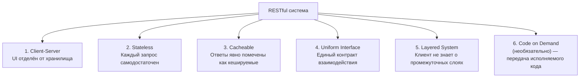
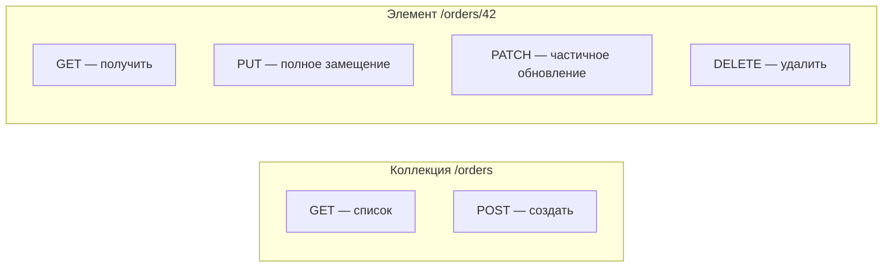
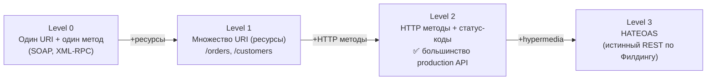

# REST: дизайн ресурсов и ограничения

> REST — не протокол и не стандарт. Это набор архитектурных ограничений. Их нарушение означает, что API не RESTful, даже если использует HTTP и JSON.

## Содержание
- [Шесть ограничений REST](#шесть-ограничений-rest)
- [Ресурсо-ориентированный дизайн URL](#ресурсо-ориентированный-дизайн-url)
- [HTTP методы и их семантика](#http-методы-и-их-семантика)
- [Idempotency и безопасность](#idempotency-и-безопасность)
- [HATEOAS и модель зрелости Ричардсона](#hateoas-и-модель-зрелости-ричардсона)
- [Подводные камни](#подводные-камни)
- [См. также](#см-также)

---

## Шесть ограничений REST

REST (Representational State Transfer) описан Роем Филдингом в 2000 году в его диссертации. Система называется RESTful только если соблюдает все шесть ограничений.



**Client-Server:** клиент не знает о внутреннем устройстве сервера, сервер не знает о UI-логике клиента. Это позволяет развивать их независимо.

**Stateless:** сервер не хранит состояние клиента между запросами. Каждый запрос содержит всю информацию, необходимую для его обработки (токен авторизации, параметры пагинации, фильтры). Сессия хранится на клиенте.

**Cacheable:** HTTP-кеширование работает только если ответы корректно помечены (`Cache-Control`, `ETag`, `Last-Modified`). Stateless + Cacheable = горизонтальное масштабирование без sticky sessions.

**Uniform Interface** — ключевое ограничение, состоит из четырёх принципов:
- Идентификация ресурсов через URI
- Манипуляция через представления (клиент получает и отправляет представление ресурса)
- Самоописывающие сообщения (заголовки описывают как обрабатывать тело)
- HATEOAS (см. ниже)

**Layered System:** клиент не знает, общается ли он напрямую с сервером или через CDN, балансировщик, API Gateway. Промежуточные слои прозрачны.

---

## Ресурсо-ориентированный дизайн URL

URI идентифицирует **ресурс** (существительное), а не **действие** (глагол). HTTP-метод — это глагол.

```
# Хорошо — существительные, иерархия
GET    /orders              ← коллекция ресурсов
GET    /orders/42           ← конкретный ресурс
POST   /orders              ← создать новый ресурс в коллекции
PUT    /orders/42           ← полное замещение ресурса
PATCH  /orders/42           ← частичное обновление
DELETE /orders/42           ← удалить ресурс

# Плохо — глаголы в URL (это RPC, не REST)
GET  /getOrders
POST /createOrder
POST /deleteOrder?id=42
POST /cancelOrder
```

**Вложенные ресурсы** — для явных отношений принадлежности:

```
GET  /orders/42/items        ← товары конкретного заказа
POST /orders/42/items        ← добавить товар в заказ
GET  /orders/42/items/7      ← конкретный товар заказа

# Но НЕ так — слишком глубокая вложенность:
GET /users/1/orders/42/items/7/reviews   ← лучше: GET /reviews?itemId=7
```

**Правило:** вложенность более 2 уровней — сигнал о проблеме дизайна. Фильтрация — через query parameters, не через путь.

```
# Ресурс с фильтрами
GET /orders?status=pending&userId=1&sort=createdAt&order=desc
GET /orders?since=2024-01-01&until=2024-06-30

# Акции над ресурсом (если нет подходящего HTTP метода)
POST /orders/42/cancel      ← sub-resource action (допустимо)
POST /orders/42/confirm
```

---

## HTTP методы и их семантика



| Метод | Коллекция `/orders` | Элемент `/orders/42` |
|-------|--------------------|--------------------|
| GET | Список ресурсов | Получить ресурс |
| POST | Создать ресурс (ID генерирует сервер) | — (редко: sub-action) |
| PUT | Заменить всю коллекцию (редко) | Полное замещение |
| PATCH | — | Частичное обновление |
| DELETE | Удалить всю коллекцию (редко) | Удалить ресурс |

**PUT vs PATCH:**

```json
// PUT /orders/42 — тело должно содержать ВЕСЬ ресурс
// Отсутствующие поля → null/default
{
  "id": 42,
  "status": "confirmed",
  "total": 1500.00,
  "customerId": 1,
  "items": [...]
}

// PATCH /orders/42 — только изменяемые поля
// JSON Merge Patch (RFC 7396):
{ "status": "confirmed" }

// JSON Patch (RFC 6902) — список операций:
[
  { "op": "replace", "path": "/status", "value": "confirmed" },
  { "op": "add", "path": "/tags/-", "value": "priority" }
]
```

---

## Idempotency и безопасность

**Безопасный (safe) метод** — не меняет состояние сервера. GET, HEAD, OPTIONS.

**Идемпотентный метод** — N вызовов с теми же параметрами эквивалентны одному вызову.

| Метод | Безопасный | Идемпотентный |
|-------|:----------:|:-------------:|
| GET | ✅ | ✅ |
| HEAD | ✅ | ✅ |
| OPTIONS | ✅ | ✅ |
| PUT | ❌ | ✅ |
| DELETE | ❌ | ✅ |
| POST | ❌ | ❌ |
| PATCH | ❌ | ❌ (зависит от реализации) |

**DELETE идемпотентен:** повторный DELETE того же ресурса даёт тот же результат (ресурс удалён). Статус может быть 404 при повторе — это нормально.

**POST не идемпотентен:** повторный POST `/orders` создаёт новый заказ. Для решения — **Idempotency-Key** заголовок:

```
POST /orders
Idempotency-Key: 550e8400-e29b-41d4-a716-446655440000

→ Сервер кешируется ответ по ключу на 24ч.
→ Повторный запрос с тем же ключом → тот же ответ, без создания дубля.
```

---

## HATEOAS и модель зрелости Ричардсона

**Модель зрелости Ричардсона** — четыре уровня «настоящего REST»:



**HATEOAS (Hypermedia As The Engine Of Application State):** сервер включает в ответ ссылки на доступные действия. Клиент не конструирует URL сам — он следует ссылкам.

```json
// GET /orders/42
{
  "id": 42,
  "status": "pending",
  "total": 1500.00,
  "_links": {
    "self":    { "href": "/orders/42",         "method": "GET" },
    "confirm": { "href": "/orders/42/confirm", "method": "POST" },
    "cancel":  { "href": "/orders/42/cancel",  "method": "POST" },
    "items":   { "href": "/orders/42/items",   "method": "GET" },
    "customer":{ "href": "/customers/1",       "method": "GET" }
  }
}
```

Клиент в состоянии `pending` знает доступные переходы из ссылок — не из жёстко зашитых URL. Когда заказ подтверждён, сервер убирает `cancel` из `_links`.

**Реальность:** HATEOAS редко реализуется полностью. Сложность реализации высокая, выгода для большинства систем минимальная (клиенты всё равно знают о структуре API). **Production API работают на Level 2** и называют себя RESTful — это норма.

---

## Подводные камни

**Глаголы в URL** — самый частый признак «не REST»:
```
POST /api/cancelOrder?id=42   ← неправильно
POST /api/orders/42/cancel    ← правильно (sub-resource action)
PATCH /api/orders/42          ← { "status": "cancelled" } — тоже правильно
```

**Stateful сессии ломают масштабирование.** Если сервер хранит состояние сессии в памяти — запрос должен попасть на тот же инстанс. Sticky sessions — антипаттерн. Состояние — в JWT, Redis, или передаётся клиентом в каждом запросе.

**Неправильная granularity URL.** Слишком широкий ресурс → overfetch. Слишком узкий → underfetch + N+1 запросов с клиента. REST не решает это структурно — нужна правильная декомпозиция ресурсов.

**OPTIONS и CORS.** Браузер перед cross-origin запросами делает preflight `OPTIONS`. Если сервер не отвечает правильно — запрос заблокирован даже при корректном GET/POST.

---

## См. также

- [02-rest-patterns.md](./02-rest-patterns.md) — версионирование, пагинация, Problem Details, ETag
- [08-comparison.md](./08-comparison.md) — когда REST проигрывает gRPC/GraphQL
