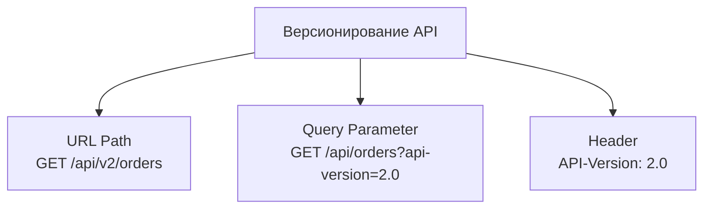
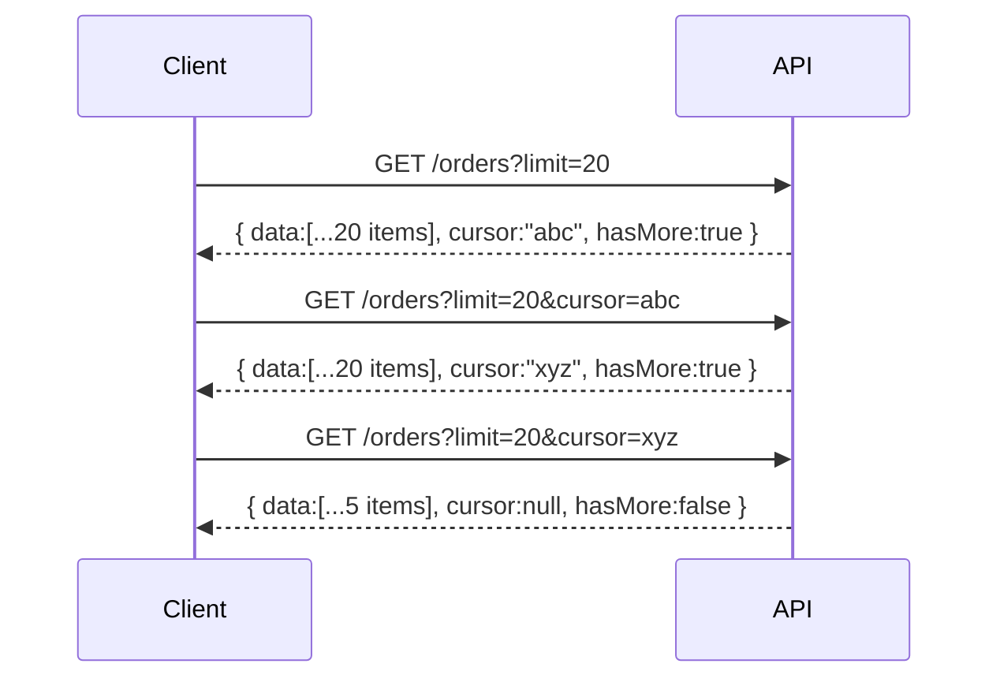
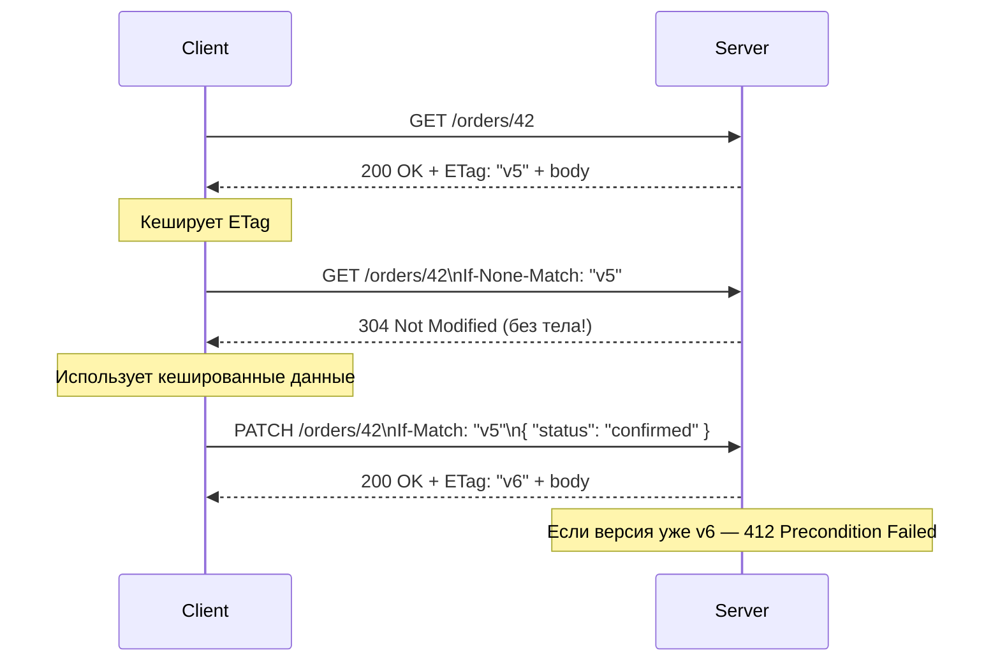

# REST: версионирование, пагинация, ошибки

> Паттерны, без которых любой REST API разваливается в production: обратная совместимость, стабильная пагинация, единый формат ошибок и HTTP-кеширование.

## Содержание
- [Версионирование API](#версионирование-api)
- [Статус-коды HTTP](#статус-коды-http)
- [Пагинация: offset vs cursor](#пагинация-offset-vs-cursor)
- [Content Negotiation](#content-negotiation)
- [Problem Details — RFC 7807](#problem-details--rfc-7807)
- [ETag и условные запросы](#etag-и-условные-запросы)
- [Idempotency-Key middleware](#idempotency-key-middleware)
- [Подводные камни](#подводные-камни)
- [См. также](#см-также)

---

## Версионирование API

Версионирование нужно для обратной совместимости при изменении контракта. Три основных стратегии:



**URL Path — самая распространённая:**

```
GET /api/v1/orders
GET /api/v2/orders
```

✅ Очевидно, легко тестировать в браузере, корректно кешируется.
❌ Один ресурс — разные URI (формально нарушает REST).

**Query Parameter:**

```
GET /api/orders?api-version=2.0
```

✅ URI ресурса не меняется.
❌ Легко забыть, сложнее роутить на уровне nginx/gateway.

**Header (Accept или кастомный):**

```
GET /api/orders
Accept: application/vnd.myapi.v2+json
API-Version: 2.0
```

✅ «Чистые» URL.
❌ Нельзя протестировать из браузера напрямую, сложнее документировать.

**.NET: Asp.Versioning (бывший Microsoft.AspNetCore.Mvc.Versioning):**

```csharp
builder.Services.AddApiVersioning(options =>
{
    options.DefaultApiVersion = new ApiVersion(1, 0);
    options.AssumeDefaultVersionWhenUnspecified = true;
    options.ReportApiVersions = true;  // заголовок api-supported-versions в ответе
    options.ApiVersionReader = ApiVersionReader.Combine(
        new UrlSegmentApiVersionReader(),
        new HeaderApiVersionReader("X-Api-Version"),
        new QueryStringApiVersionReader("api-version")
    );
});

[ApiController]
[Route("api/v{version:apiVersion}/orders")]
[ApiVersion("1.0")]
[ApiVersion("2.0")]
public class OrdersController : ControllerBase
{
    [HttpGet]
    [MapToApiVersion("1.0")]
    public IActionResult GetV1() => Ok(new { version = "v1" });

    [HttpGet]
    [MapToApiVersion("2.0")]
    public IActionResult GetV2() => Ok(new { version = "v2", extra = true });
}
```

---

## Статус-коды HTTP

Правильные коды — часть контракта. Их нарушение ломает кеширование, мониторинг и интеграции.

| Код | Название | Когда использовать |
|-----|----------|-------------------|
| **200** | OK | GET успешен; PUT/PATCH с телом ответа |
| **201** | Created | POST создал ресурс; добавить `Location: /orders/42` |
| **204** | No Content | DELETE успешен; PUT/PATCH без тела ответа |
| **400** | Bad Request | Невалидные данные запроса, ошибки валидации |
| **401** | Unauthorized | Не аутентифицирован (нет токена / токен невалиден) |
| **403** | Forbidden | Аутентифицирован, но нет прав на ресурс |
| **404** | Not Found | Ресурс не существует |
| **409** | Conflict | Конфликт состояния (дублирующий email, оптимистичная блокировка) |
| **410** | Gone | Ресурс существовал, но удалён навсегда |
| **422** | Unprocessable Entity | Синтаксис верен, но семантически некорректно |
| **429** | Too Many Requests | Rate limiting (добавить `Retry-After` заголовок) |
| **500** | Internal Server Error | Непредвиденная ошибка сервера |
| **503** | Service Unavailable | Сервис временно недоступен (добавить `Retry-After`) |

```
# Ошибка: всегда 200, ошибка в теле
POST /orders → 200 OK { "error": "Customer not found" }

# Правильно
POST /orders → 404 Not Found + Problem Details body
```

---

## Пагинация: offset vs cursor

### Offset-based

```
GET /orders?page=3&pageSize=20
GET /orders?offset=40&limit=20
```

```json
{
  "data": [...],
  "pagination": {
    "total": 1000,
    "page": 3,
    "pageSize": 20,
    "totalPages": 50
  }
}
```

✅ Произвольный переход на страницу.
❌ `COUNT(*)` на больших таблицах — дорого.
❌ При вставке/удалении между запросами — пропуски и дубли.

### Cursor-based (keyset pagination)

```
GET /orders?limit=20
← { "data": [...], "cursor": "eyJpZCI6NDJ9", "hasMore": true }

GET /orders?limit=20&cursor=eyJpZCI6NDJ9
← следующая страница
```

Курсор — base64 от идентификатора последнего элемента. В SQL транслируется в `WHERE id > :last_id ORDER BY id LIMIT 20`.

✅ Стабильная пагинация — нет пропусков при вставке.
✅ Нет дорогого `COUNT(*)`.
✅ O(1) независимо от глубины страницы (нет OFFSET-скана).
❌ Нельзя перейти на произвольную страницу.

```csharp
public record PageResult<T>(IReadOnlyList<T> Data, string? NextCursor, bool HasMore);

public async Task<PageResult<Order>> GetAsync(string? cursor, int limit)
{
    var query = _db.Orders.OrderBy(o => o.Id).AsQueryable();

    if (cursor is not null)
    {
        var lastId = long.Parse(
            Encoding.UTF8.GetString(Convert.FromBase64String(cursor)));
        query = query.Where(o => o.Id > lastId);
    }

    // Берём limit+1 чтобы узнать есть ли следующая страница
    var items = await query.Take(limit + 1).ToListAsync();
    var hasMore = items.Count > limit;
    if (hasMore) items.RemoveAt(items.Count - 1);

    string? nextCursor = null;
    if (hasMore)
        nextCursor = Convert.ToBase64String(
            Encoding.UTF8.GetBytes(items[^1].Id.ToString()));

    return new PageResult<Order>(items, nextCursor, hasMore);
}
```



---

## Content Negotiation

Клиент указывает предпочтительный формат через `Accept`, сервер отвечает в нём и указывает `Content-Type`.

```
GET /orders/42
Accept: application/json         → JSON response
Accept: application/xml          → XML response
Accept: text/csv                 → CSV response
Accept: application/vnd.myapi.v2+json  → vendor MIME type
```

**Внутри ASP.NET Core:**

```
1. Accept: application/xml
2. ActionResult<T> → ObjectResult с Value = объект
3. OutputFormatterSelector итерирует зарегистрированные форматтеры
4. Проверяет CanWriteType() и CanWriteResult()
5. Выбирает первый подходящий
6. Если не найден и ReturnHttpNotAcceptable = true → 406 Not Acceptable
```

```csharp
builder.Services.AddControllers(options =>
{
    options.RespectBrowserAcceptHeader = true;
    options.ReturnHttpNotAcceptable = true;
})
.AddXmlSerializerFormatters();
```

---

## Problem Details — RFC 7807

Стандартный формат ошибок. Единая схема вместо произвольных JSON-структур.

```json
{
  "type": "https://api.example.com/errors/validation-failed",
  "title": "Validation Failed",
  "status": 422,
  "detail": "Field 'email' is not a valid email address",
  "instance": "/orders",
  "traceId": "00-4bf92f3577b34da6a3ce929d0e0e4736-00f067aa0ba902b7-01",
  "errors": {
    "email": ["Not a valid email address"],
    "quantity": ["Must be greater than 0"]
  }
}
```

**.NET 8 — глобальный обработчик:**

```csharp
public class GlobalExceptionHandler : IExceptionHandler
{
    private readonly ILogger<GlobalExceptionHandler> _logger;

    public GlobalExceptionHandler(ILogger<GlobalExceptionHandler> logger)
        => _logger = logger;

    public async ValueTask<bool> TryHandleAsync(
        HttpContext context,
        Exception exception,
        CancellationToken token)
    {
        _logger.LogError(exception, "Unhandled exception: {Message}", exception.Message);

        var (status, title) = exception switch
        {
            NotFoundException    => (404, "Not Found"),
            ValidationException  => (422, "Validation Failed"),
            ConflictException    => (409, "Conflict"),
            UnauthorizedException => (401, "Unauthorized"),
            _                    => (500, "Internal Server Error")
        };

        var problem = new ProblemDetails
        {
            Status = status,
            Title = title,
            Detail = exception.Message,
            Instance = context.Request.Path
        };
        problem.Extensions["traceId"] =
            Activity.Current?.Id ?? context.TraceIdentifier;

        context.Response.StatusCode = status;
        await context.Response.WriteAsJsonAsync(problem, token);
        return true;
    }
}

// Program.cs
builder.Services.AddExceptionHandler<GlobalExceptionHandler>();
builder.Services.AddProblemDetails();
app.UseExceptionHandler();
```

---

## ETag и условные запросы

ETag — хеш или версия ресурса. Позволяет избежать передачи тела при отсутствии изменений (304 Not Modified).



```csharp
app.MapGet("/orders/{id:long}", async (long id, HttpContext ctx, IOrderService svc) =>
{
    var order = await svc.GetAsync(id);
    if (order is null) return Results.NotFound();

    var etag = $"\"{order.Version}\"";

    // Проверка If-None-Match → 304 если не изменился
    if (ctx.Request.Headers.IfNoneMatch == etag)
        return Results.StatusCode(304);

    ctx.Response.Headers.ETag = etag;
    return Results.Ok(order);
});

// Для PUT/PATCH: If-Match предотвращает потерянное обновление (optimistic concurrency)
app.MapPatch("/orders/{id:long}", async (long id, HttpContext ctx, UpdateRequest req, IOrderService svc) =>
{
    var ifMatch = ctx.Request.Headers.IfMatch.FirstOrDefault();
    var order = await svc.GetAsync(id);
    if (order is null) return Results.NotFound();

    if (ifMatch is not null && ifMatch != $"\"{order.Version}\"")
        return Results.StatusCode(412); // Precondition Failed

    var updated = await svc.UpdateAsync(id, req);
    ctx.Response.Headers.ETag = $"\"{updated.Version}\"";
    return Results.Ok(updated);
});
```

---

## Idempotency-Key middleware

Делает POST идемпотентным: клиент генерирует UUID, сервер кеширует результат по ключу.

```csharp
public class IdempotencyMiddleware
{
    private readonly RequestDelegate _next;
    private readonly IDistributedCache _cache;

    public IdempotencyMiddleware(RequestDelegate next, IDistributedCache cache)
    {
        _next = next;
        _cache = cache;
    }

    public async Task InvokeAsync(HttpContext context)
    {
        if (context.Request.Method != "POST" ||
            !context.Request.Headers.TryGetValue("Idempotency-Key", out var key))
        {
            await _next(context);
            return;
        }

        var cached = await _cache.GetStringAsync($"idem:{key}");
        if (cached is not null)
        {
            context.Response.StatusCode = 200;
            context.Response.ContentType = "application/json";
            context.Response.Headers["X-Idempotency-Replayed"] = "true";
            await context.Response.WriteAsync(cached);
            return;
        }

        var original = context.Response.Body;
        using var buffer = new MemoryStream();
        context.Response.Body = buffer;

        await _next(context);

        buffer.Seek(0, SeekOrigin.Begin);
        var body = await new StreamReader(buffer).ReadToEndAsync();

        if (context.Response.StatusCode is >= 200 and < 300)
        {
            await _cache.SetStringAsync($"idem:{key}", body,
                new DistributedCacheEntryOptions
                {
                    AbsoluteExpirationRelativeToNow = TimeSpan.FromHours(24)
                });
        }

        buffer.Seek(0, SeekOrigin.Begin);
        await buffer.CopyToAsync(original);
        context.Response.Body = original;
    }
}
```

---

## Подводные камни

**Версионирование откладывают до первого breaking change** — и тогда спешно переделывают всё. Версионирование нужно закладывать с первого endpoint'а, даже если пока одна версия.

**`total` в пагинации убивает производительность.** `SELECT COUNT(*)` на таблице в 100M строк — несколько секунд. Cursor-based пагинация не требует `total`. Если нужен count — отдавать приближённый (`reltuples` из PostgreSQL).

**ETag по хешу тела — дорого при большом ответе.** Лучше использовать `rowversion`/`updated_at` из БД, который уже есть на объекте.

**Problem Details и 500.** Никогда не включать внутренние детали исключения в `detail` в production — утечка информации. Только в Development среде. В production — только `traceId` для корреляции с логами.

**`Idempotency-Key` не защищает от race condition.** Если два запроса с одним ключом приходят одновременно — оба могут пройти мимо кеша. Нужна distributed lock вокруг операции (Redis `SET NX`).

---

## См. также

- [01-rest-design.md](./01-rest-design.md) — принципы REST, URL дизайн, HTTP методы
- [08-comparison.md](./08-comparison.md) — REST vs GraphQL по over/under-fetching
