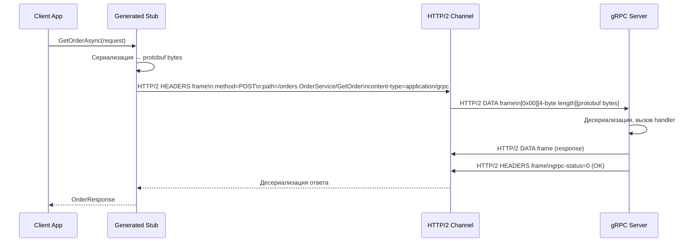
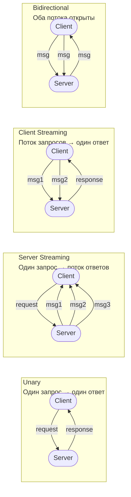
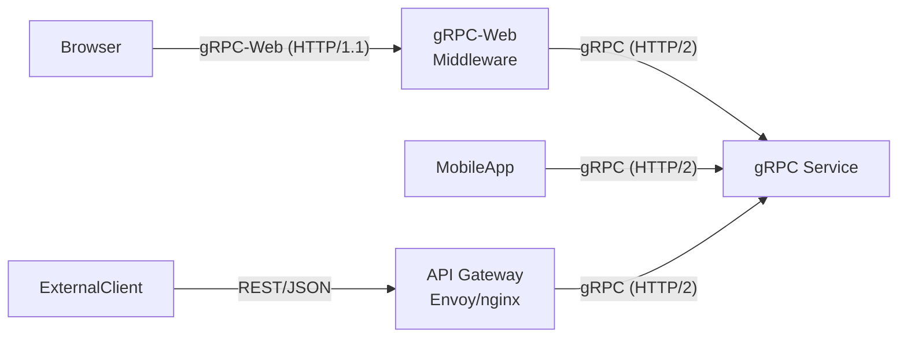

# gRPC в .NET: стриминг, Interceptors, gRPC-Web

> gRPC в .NET — это не просто HTTP/2 + protobuf. Четыре типа стриминга, Interceptors как middleware, gRPC-Web для браузеров. Каждая деталь влияет на дизайн API.

## Содержание
- [Что происходит при gRPC вызове](#что-происходит-при-grpc-вызове)
- [Четыре типа стриминга](#четыре-типа-стриминга)
- [Grpc.AspNetCore — сервер и клиент](#grpcaspnetcore--сервер-и-клиент)
- [Interceptors](#interceptors)
- [Health Check и Reflection](#health-check-и-reflection)
- [gRPC-Web](#grpc-web)
- [Подводные камни](#подводные-камни)
- [См. также](#см-также)

---

## Что происходит при gRPC вызове



**Length-Prefixed Message** — формат обёртки вокруг protobuf в gRPC:
```
[compressed: 1 byte][message length: 4 bytes][message: N bytes]
  └─ 0=uncompressed, 1=compressed
```

При ошибке сервер отправляет только HEADERS frame:
```
grpc-status=5      (5 = NOT_FOUND)
grpc-message=Order 42 not found
```

---

## Четыре типа стриминга



### Unary RPC

```csharp
// Сервер
public override async Task<OrderResponse> GetOrder(
    GetOrderRequest request,
    ServerCallContext context)
{
    var order = await _repository.FindAsync(request.Id, context.CancellationToken)
        ?? throw new RpcException(new Status(StatusCode.NotFound,
               $"Order {request.Id} not found"));

    return MapToResponse(order);
}

// Клиент
var response = await _client.GetOrderAsync(
    new GetOrderRequest { Id = 42 },
    cancellationToken: token);
```

### Server Streaming

```csharp
// Сервер: отправляет поток, клиент получает по одному
public override async Task ListOrders(
    ListOrdersRequest request,
    IServerStreamWriter<OrderResponse> stream,
    ServerCallContext context)
{
    await foreach (var order in _repository.StreamByCustomerAsync(request.CustomerId))
    {
        if (context.CancellationToken.IsCancellationRequested) break;
        await stream.WriteAsync(MapToResponse(order));
    }
}

// Клиент
using var call = _client.ListOrders(new ListOrdersRequest { CustomerId = 1 });
await foreach (var order in call.ResponseStream.ReadAllAsync(token))
{
    Console.WriteLine($"Received: {order.Id}");
}
```

### Client Streaming

```csharp
// Сервер: читает поток от клиента, возвращает один ответ
public override async Task<BatchResult> BatchCreate(
    IAsyncStreamReader<CreateOrderRequest> stream,
    ServerCallContext context)
{
    var count = 0;
    await foreach (var request in stream.ReadAllAsync())
    {
        await _repository.CreateAsync(Map(request));
        count++;
    }
    return new BatchResult { Created = count };
}

// Клиент
using var call = _client.BatchCreate();
foreach (var req in requests)
    await call.RequestStream.WriteAsync(req);
await call.RequestStream.CompleteAsync();  // сигнал конца потока
var result = await call.ResponseAsync;
```

### Bidirectional Streaming

```csharp
// Сервер: одновременно читает запросы и отправляет ответы
public override async Task WatchOrders(
    IAsyncStreamReader<WatchRequest> requests,
    IServerStreamWriter<OrderResponse> responses,
    ServerCallContext context)
{
    var subscriptions = new HashSet<long>();

    await foreach (var request in requests.ReadAllAsync())
    {
        foreach (var id in request.OrderIds)
            subscriptions.Add(id);

        // Отправляем текущее состояние для новых подписок
        foreach (var id in request.OrderIds)
        {
            var order = await _repository.FindAsync(id);
            if (order is not null)
                await responses.WriteAsync(MapToResponse(order));
        }
    }
}

// Клиент: параллельно читает и пишет
using var call = _client.WatchOrders();

// Запись в отдельной задаче
var writeTask = Task.Run(async () =>
{
    await call.RequestStream.WriteAsync(new WatchRequest { OrderIds = { 1, 2, 3 } });
    await Task.Delay(1000);
    await call.RequestStream.WriteAsync(new WatchRequest { OrderIds = { 4, 5 } });
    await call.RequestStream.CompleteAsync();
});

// Чтение в основном потоке
await foreach (var order in call.ResponseStream.ReadAllAsync(token))
    Console.WriteLine($"Update: {order.Id} → {order.Status}");

await writeTask;
```

---

## Grpc.AspNetCore — сервер и клиент

### Сервер

```csharp
// Program.cs
builder.Services.AddGrpc(options =>
{
    options.EnableDetailedErrors = builder.Environment.IsDevelopment();
    options.MaxReceiveMessageSize = 4 * 1024 * 1024;  // 4 MB
    options.MaxSendMessageSize    = 4 * 1024 * 1024;
    options.Interceptors.Add<LoggingInterceptor>();
});
builder.Services.AddGrpcReflection();  // для grpcurl/Postman

app.MapGrpcService<OrderGrpcService>();
app.MapGrpcReflectionService();
```

```csharp
// OrderGrpcService.cs — наследуем от сгенерированного базового класса
public class OrderGrpcService : OrderService.OrderServiceBase
{
    private readonly IOrderRepository _repository;
    private readonly ILogger<OrderGrpcService> _logger;

    public OrderGrpcService(IOrderRepository repository, ILogger<OrderGrpcService> logger)
    {
        _repository = repository;
        _logger = logger;
    }

    public override async Task<OrderResponse> GetOrder(
        GetOrderRequest request,
        ServerCallContext context)
    {
        _logger.LogInformation("GetOrder for id={OrderId}", request.Id);

        var order = await _repository.FindAsync(request.Id, context.CancellationToken)
            ?? throw new RpcException(new Status(StatusCode.NotFound,
                   $"Order {request.Id} not found"));

        return new OrderResponse
        {
            Id = order.Id,
            CustomerId = order.CustomerId,
            Status = (OrderStatus)order.Status,
            CreatedAt = Timestamp.FromDateTime(order.CreatedAt.ToUniversalTime())
        };
    }
}
```

### Клиент

```xml
<!-- Клиентский проект -->
<Protobuf Include="Protos\orders.proto" GrpcServices="Client" />
```

```csharp
// Регистрация типизированного gRPC клиента с retry policy
builder.Services.AddGrpcClient<OrderService.OrderServiceClient>(options =>
{
    options.Address = new Uri("https://orderservice:8080");
})
.ConfigureChannel(channel =>
{
    channel.HttpHandler = new SocketsHttpHandler
    {
        PooledConnectionIdleTimeout = Timeout.InfiniteTimeSpan,
        KeepAlivePingDelay   = TimeSpan.FromSeconds(60),
        KeepAlivePingTimeout = TimeSpan.FromSeconds(30),
        EnableMultipleHttp2Connections = true
    };
})
.AddPolicyHandler(GetRetryPolicy());

static IAsyncPolicy<HttpResponseMessage> GetRetryPolicy() =>
    HttpPolicyExtensions
        .HandleTransientHttpError()
        .WaitAndRetryAsync(3, i => TimeSpan.FromSeconds(Math.Pow(2, i)));
```

```csharp
// Использование в сервисе
public class OrderApiClient
{
    private readonly OrderService.OrderServiceClient _client;

    public OrderApiClient(OrderService.OrderServiceClient client) => _client = client;

    public async Task<OrderResponse> GetAsync(long id, CancellationToken token)
    {
        try
        {
            return await _client.GetOrderAsync(
                new GetOrderRequest { Id = id },
                cancellationToken: token);
        }
        catch (RpcException ex) when (ex.StatusCode == StatusCode.NotFound)
        {
            throw new NotFoundException($"Order {id} not found");
        }
        catch (RpcException ex) when (ex.StatusCode == StatusCode.Unavailable)
        {
            throw new ServiceUnavailableException("Order service is unavailable");
        }
    }
}
```

---

## Interceptors

Interceptors — аналог middleware для gRPC. Перехватывают вызовы до/после обработчика.

### Серверный interceptor

```csharp
public class LoggingInterceptor : Interceptor
{
    private readonly ILogger<LoggingInterceptor> _logger;

    public LoggingInterceptor(ILogger<LoggingInterceptor> logger) => _logger = logger;

    public override async Task<TResponse> UnaryServerHandler<TRequest, TResponse>(
        TRequest request,
        ServerCallContext context,
        UnaryServerMethod<TRequest, TResponse> continuation)
    {
        _logger.LogInformation("gRPC {Method} started", context.Method);
        var sw = Stopwatch.StartNew();
        try
        {
            var response = await continuation(request, context);
            _logger.LogInformation("gRPC {Method} OK in {Ms}ms",
                context.Method, sw.ElapsedMilliseconds);
            return response;
        }
        catch (Exception ex)
        {
            _logger.LogError(ex, "gRPC {Method} failed", context.Method);
            throw;
        }
    }

    // Аналогично для ServerStreamingServerHandler, ClientStreamingServerHandler,
    // DuplexStreamingServerHandler — перехватывают соответствующие типы
    public override async Task ServerStreamingServerHandler<TRequest, TResponse>(
        TRequest request,
        IServerStreamWriter<TResponse> stream,
        ServerCallContext context,
        ServerStreamingServerMethod<TRequest, TResponse> continuation)
    {
        _logger.LogInformation("gRPC streaming {Method} started", context.Method);
        await continuation(request, stream, context);
    }
}
```

### Клиентский interceptor (авторизация)

```csharp
public class AuthInterceptor : Interceptor
{
    private readonly ITokenProvider _tokenProvider;

    public AuthInterceptor(ITokenProvider tokenProvider) => _tokenProvider = tokenProvider;

    public override AsyncUnaryCall<TResponse> AsyncUnaryCall<TRequest, TResponse>(
        TRequest request,
        ClientInterceptorContext<TRequest, TResponse> context,
        AsyncUnaryCallContinuation<TRequest, TResponse> continuation)
    {
        var headers = context.Options.Headers ?? new Metadata();
        headers.Add("Authorization", $"Bearer {_tokenProvider.GetToken()}");

        var newContext = new ClientInterceptorContext<TRequest, TResponse>(
            context.Method, context.Host,
            context.Options.WithHeaders(headers));

        return continuation(request, newContext);
    }
}

// Регистрация клиентского interceptor
builder.Services.AddGrpcClient<OrderService.OrderServiceClient>(...)
    .AddInterceptor<AuthInterceptor>();
```

---

## Health Check и Reflection

**gRPC Health Checking Protocol** — стандартный протокол проверки доступности сервиса:

```csharp
builder.Services.AddGrpcHealthChecks()
    .AddCheck<DatabaseHealthCheck>("database")
    .AddCheck<RedisHealthCheck>("redis");

app.MapGrpcHealthChecksService();
```

```bash
# Проверка через grpc-health-probe
grpc-health-probe -addr=localhost:8080
grpc-health-probe -addr=localhost:8080 -service=orders.OrderService

# Kubernetes readiness probe
readinessProbe:
  exec:
    command: ["/bin/grpc-health-probe", "-addr=:8080"]
  initialDelaySeconds: 5
  periodSeconds: 10
```

**gRPC Server Reflection** — позволяет grpcurl и Postman получать схему без .proto файлов:

```bash
# Список всех сервисов
grpcurl -plaintext localhost:8080 list

# Описание сервиса
grpcurl -plaintext localhost:8080 describe orders.OrderService

# Вызов метода
grpcurl -plaintext \
  -d '{"id": 42}' \
  localhost:8080 \
  orders.OrderService/GetOrder
```

---

## gRPC-Web

Браузеры не поддерживают HTTP/2 trailers (нужны для gRPC). gRPC-Web решает это через эмуляцию trailers в теле ответа.



```csharp
builder.Services.AddGrpc();
builder.Services.AddGrpcWeb(options => options.GrpcWebEnabled = true);

app.UseGrpcWeb();
app.MapGrpcService<OrderGrpcService>().EnableGrpcWeb();
```

**Альтернатива gRPC-Web:** API Gateway (Envoy) транслирует REST JSON → gRPC Protobuf — клиент использует REST, внутри всё gRPC.

---

## Подводные камни

**gRPC требует HTTP/2.** В .NET это означает обязательный TLS в production (Kestrel по умолчанию). Без TLS — только `h2c` (cleartext HTTP/2), нужно явно настраивать.

```csharp
// Для development без TLS (Docker, тесты)
AppContext.SetSwitch("System.Net.Http.SocketsHttpHandler.Http2UnencryptedSupport", true);
builder.Services.AddGrpcClient<OrderService.OrderServiceClient>(o =>
    o.Address = new Uri("http://orderservice:8080"));  // http, не https
```

**Deadline/Timeout — не автоматический.** В gRPC нет встроенного таймаута по умолчанию. Нужно явно передавать `Deadline`:

```csharp
var deadline = DateTime.UtcNow.AddSeconds(5);
var response = await _client.GetOrderAsync(
    request,
    deadline: deadline,
    cancellationToken: token);
// При превышении: RpcException с StatusCode.DeadlineExceeded
```

**Streaming и backpressure.** При server streaming сервер отправляет данные быстрее, чем клиент читает → накопление в буферах. gRPC поверх HTTP/2 имеет flow control, но нужно проверять `CancellationToken` на каждой итерации.

**StatusCode != HTTP статус-код.** gRPC имеет свои коды: `OK=0`, `CANCELLED=1`, `NOT_FOUND=5`, `ALREADY_EXISTS=6`, `PERMISSION_DENIED=7`, `UNAVAILABLE=14`. Они не совпадают с HTTP 404, 403 и т.д.

---

## См. также

- [03-grpc-protobuf.md](./03-grpc-protobuf.md) — Protocol Buffers: схема, бинарное кодирование
- [08-comparison.md](./08-comparison.md) — когда gRPC vs REST: производительность, браузеры, streaming
