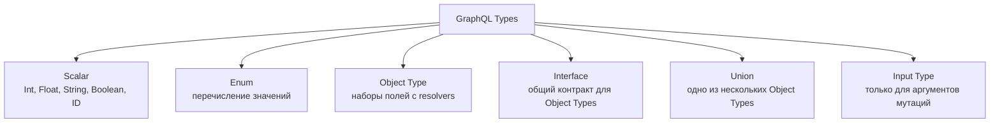
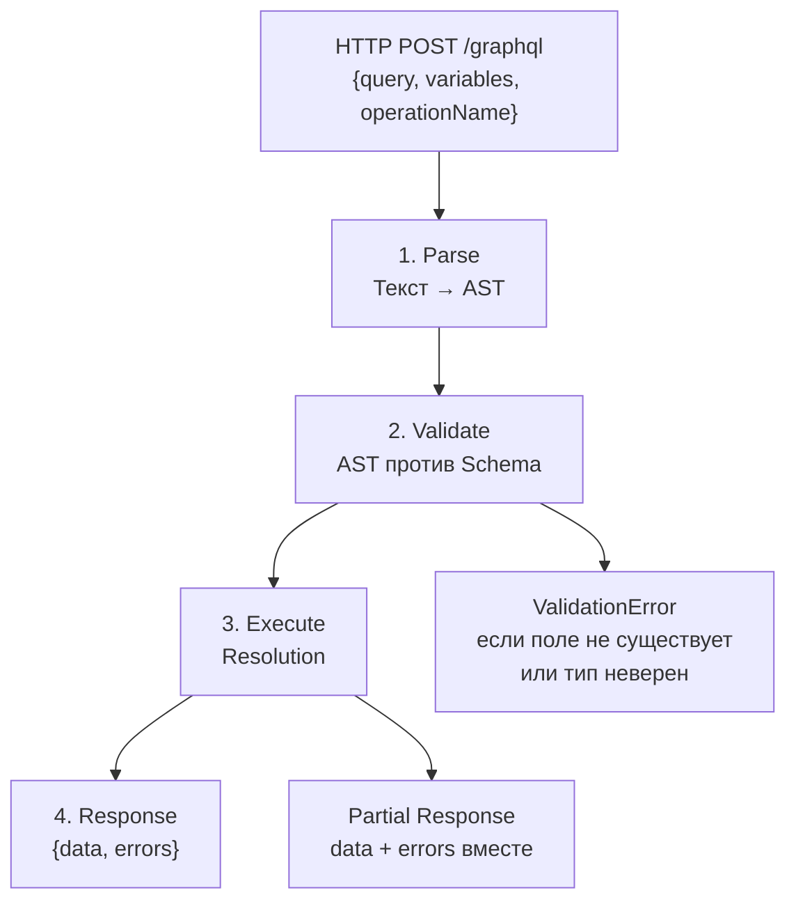
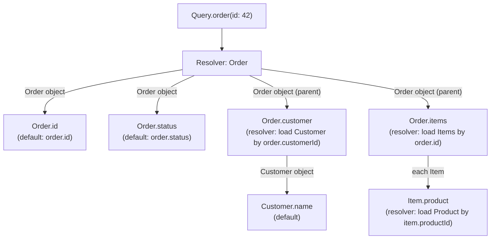

# GraphQL: схема, типы, execution pipeline

> GraphQL — это язык запросов, а не протокол. Клиент описывает нужные поля — сервер возвращает ровно их. Понять execution pipeline значит понять, откуда берётся N+1 и почему DataLoader нужен.

## Содержание
- [Проблемы REST, которые решает GraphQL](#проблемы-rest-которые-решает-graphql)
- [Schema Definition Language](#schema-definition-language)
- [Система типов](#система-типов)
- [Query, Mutation, Subscription](#query-mutation-subscription)
- [Execution Pipeline](#execution-pipeline)
- [Resolvers под капотом](#resolvers-под-капотом)
- [Подводные камни](#подводные-камни)
- [См. также](#см-также)

---

## Проблемы REST, которые решает GraphQL

**Over-fetching** — REST возвращает полный объект, клиенту нужны 2 поля:

```
GET /orders/42
← { id, status, total, customerId, createdAt, updatedAt, address, notes, ... }
Мобильное приложение использует: id, status, total
```

**Under-fetching** — для одного экрана нужно N запросов:

```
GET /orders/42          ← заказ
GET /customers/1        ← покупатель (из заказа)
GET /orders/42/items    ← товары
GET /products/10        ← данные товара (из items)
```

**GraphQL решает оба:**

```graphql
query {
    order(id: 42) {
        id
        status
        total
        customer { name email }
        items {
            quantity
            product { name sku }
        }
    }
}
```

Один запрос — ровно нужные поля — все связанные данные.

---

## Schema Definition Language

Schema — единственный источник правды. Описывает все типы, запросы и мутации.

```graphql
# Скалярные типы: Int, Float, String, Boolean, ID
# ! = Non-null (обязательное поле)

type Order {
    id:        ID!
    customer:  Customer!
    status:    OrderStatus!
    items:     [OrderItem!]!   # Non-null массив non-null элементов
    total:     Float!
    createdAt: String!
    notes:     String          # nullable — может отсутствовать
}

type Customer {
    id:     ID!
    name:   String!
    email:  String!
    orders(first: Int, after: String): OrderConnection!
}

type OrderItem {
    product:  Product!
    quantity: Int!
    price:    Float!
}

type Product {
    id:   ID!
    name: String!
    sku:  String!
}

enum OrderStatus {
    PENDING
    CONFIRMED
    SHIPPED
    CANCELLED
}

# Input types — только для аргументов (нельзя использовать обычные types)
input CreateOrderInput {
    customerId: ID!
    items: [OrderItemInput!]!
}

input OrderItemInput {
    productId: ID!
    quantity:  Int!
}

# Точки входа
type Query {
    order(id: ID!): Order          # nullable — может вернуть null если не найден
    orders(
        first:  Int
        after:  String
        status: OrderStatus
    ): OrderConnection!
    customer(id: ID!): Customer
}

type Mutation {
    createOrder(input: CreateOrderInput!): Order!
    cancelOrder(id: ID!): Order!
}

type Subscription {
    orderStatusChanged(orderId: ID!): Order!
}

# Relay-style пагинация
type OrderConnection {
    edges:    [OrderEdge!]!
    pageInfo: PageInfo!
    totalCount: Int!
}

type OrderEdge {
    node:   Order!
    cursor: String!
}

type PageInfo {
    hasNextPage:     Boolean!
    hasPreviousPage: Boolean!
    startCursor:     String
    endCursor:       String
}
```

---

## Система типов



**Interface** — несколько типов реализуют общий контракт:

```graphql
interface Node {
    id: ID!
}

type Order    implements Node { id: ID!  status: OrderStatus! }
type Customer implements Node { id: ID!  name: String! }

query {
    node(id: "42") {
        id  # доступно через interface
        ... on Order    { status }  # inline fragment
        ... on Customer { name }
    }
}
```

**Union** — поле может быть одним из нескольких типов:

```graphql
union SearchResult = Order | Customer | Product

type Query {
    search(query: String!): [SearchResult!]!
}

query {
    search(query: "Alice") {
        ... on Order    { id status }
        ... on Customer { name email }
        ... on Product  { name sku }
    }
}
```

---

## Query, Mutation, Subscription

**Query — чтение, поля верхнего уровня выполняются параллельно:**

```graphql
# Именованный query с переменными
query GetOrderDetails($id: ID!) {
    order(id: $id) {
        id
        status
        customer { name email }
        items {
            quantity
            product { name sku }
        }
    }
}
```

**Fragments — переиспользуемые наборы полей:**

```graphql
fragment OrderSummary on Order {
    id
    status
    total
    createdAt
}

query GetOrders {
    orders(first: 10) {
        edges {
            node {
                ...OrderSummary         # раскрывается как inline
                customer { name }
            }
        }
    }
}
```

**Mutation — изменение данных, выполняются строго последовательно:**

```graphql
mutation CreateAndConfirm($input: CreateOrderInput!) {
    createOrder(input: $input) {
        id
        status
    }
    # Если несколько мутаций — вторая начнётся после завершения первой
}
```

Переменные передаются отдельно от запроса:
```json
{
  "input": {
    "customerId": "1",
    "items": [{ "productId": "10", "quantity": 2 }]
  }
}
```

**Subscription — real-time через WebSocket:**

```graphql
subscription OnOrderUpdate($orderId: ID!) {
    orderStatusChanged(orderId: $orderId) {
        id
        status
    }
}
```

GraphQL Subscriptions работают поверх WebSocket (`graphql-ws` протокол) или Server-Sent Events.

---

## Execution Pipeline



**Parse:** текст GraphQL запроса парсируется в AST (Abstract Syntax Tree). Дорогая операция — хорошие реализации кешируют AST.

**Validate:** AST проверяется против схемы:
- Все запрошенные поля существуют?
- Типы аргументов совпадают?
- Нет циклических фрагментов?
- Не превышена глубина запроса?

**Execute:** обход AST и вызов resolvers.

**Partial Response:** GraphQL разрешает возвращать частичный ответ при ошибках в отдельных полях:
```json
{
  "data": {
    "order": {
      "id": "42",
      "customer": null,
      "items": [...]
    }
  },
  "errors": [
    {
      "message": "Customer not found",
      "path": ["order", "customer"],
      "locations": [{ "line": 4, "column": 5 }]
    }
  ]
}
```

---

## Resolvers под капотом

Каждое поле в схеме имеет **resolver** — функцию, возвращающую значение. Если resolver не определён явно, используется **default resolver**: читает свойство объекта с тем же именем.



**Порядок выполнения:**
1. Поля верхнего уровня (`Query.order`, `Query.customer`) — **параллельно**
2. Вложенные поля одного объекта — **параллельно**
3. Resolver вложенного поля вызывается **после** резолвинга родителя
4. Мутации верхнего уровня — **строго последовательно**

**Resolver получает:** `parent` (результат родительского resolver), `args` (аргументы поля), `context` (shared контекст — DI, пользователь), `info` (AST узел поля).

**Без оптимизации 100 заказов с покупателями = N+1:**
```
Resolver Order.customer вызывается для каждого из 100 заказов
→ 100 SELECT * FROM customers WHERE id = ?
```

Решение — DataLoader (см. `06-graphql-hotchocolate.md`).

---

## Подводные камни

**Introspection в production.** `__schema` и `__type` запросы раскрывают всю схему. Злоумышленник может получить карту всех ваших типов и связей. Отключай в production:

```csharp
// HotChocolate
builder.Services.AddGraphQLServer()
    .ModifyRequestOptions(opt =>
        opt.EnableSchemaIntrospection =
            builder.Environment.IsDevelopment());
```

**Query complexity — защита от DoS.** Клиент может написать запрос с бесконечной глубиной:
```graphql
{ orders { customer { orders { customer { orders { ... } } } } } }
```

Нужно ограничение глубины и сложности:
```csharp
.AddMaxExecutionDepthRule(10)
.AddDocumentComplexityAnalyzer(maxAllowedComplexity: 1000)
```

**Кеширование сложнее чем в REST.** GraphQL обычно использует `POST` с телом запроса — HTTP-кеши не работают. Кеширование нужно реализовывать на уровне DataLoader и application cache.

**Nullable vs Non-null и ошибки.** Если поле `customer: Customer!` (non-null) и resolver бросает исключение — GraphQL nullifies всё дерево до ближайшего nullable родителя. При неправильной разметке nullable/non-null — целые секции данных пропадают.

---

## См. также

- [06-graphql-hotchocolate.md](./06-graphql-hotchocolate.md) — N+1 + DataLoader, HotChocolate, пагинация, subscriptions
- [08-comparison.md](./08-comparison.md) — когда GraphQL vs REST vs gRPC
