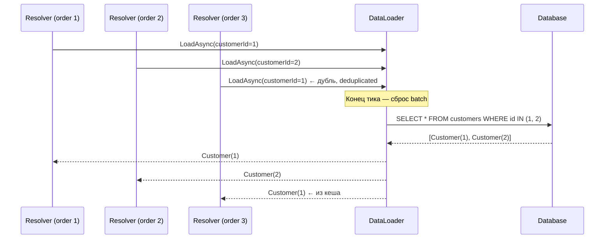

# GraphQL в .NET: HotChocolate, DataLoader, пагинация

> DataLoader — обязательный паттерн в GraphQL. Без него любой запрос списка + вложенных данных → N+1 к БД. HotChocolate автоматизирует большинство шаблонного кода.

## Содержание
- [N+1 проблема в GraphQL](#n1-проблема-в-graphql)
- [DataLoader: batching и deduplication](#dataloader-batching-и-deduplication)
- [HotChocolate — setup](#hotchocolate--setup)
- [Code-first типы и resolvers](#code-first-типы-и-resolvers)
- [Projections, Filtering, Sorting](#projections-filtering-sorting)
- [Relay Cursor пагинация](#relay-cursor-пагинация)
- [Subscriptions](#subscriptions)
- [Подводные камни](#подводные-камни)
- [См. также](#см-также)

---

## N+1 проблема в GraphQL

```graphql
query {
    orders(first: 100) {
        edges {
            node {
                id
                customer { name email }
            }
        }
    }
}
```

**Без DataLoader:**
```
SELECT * FROM orders LIMIT 100;
SELECT * FROM customers WHERE id = 1;
SELECT * FROM customers WHERE id = 2;
SELECT * FROM customers WHERE id = 1;   ← дубль!
SELECT * FROM customers WHERE id = 5;
-- ... ещё 96 запросов, многие с дублями
```

Resolver `Order.customer` вызывается **для каждого** из 100 заказов → 101 запрос к БД.

---

## DataLoader: batching и deduplication

DataLoader накапливает ключи за один «тик» выполнения GraphQL запроса, затем выполняет один batch-запрос.



**Deduplication:** ключи дедуплицируются до выполнения запроса.
**Batching:** один SQL запрос с `IN (...)` вместо N отдельных.
**Caching:** результат кешируется в рамках одного GraphQL запроса (не между запросами).

```csharp
// BatchDataLoader — загружает по ключам, возвращает словарь
public class CustomerByIdDataLoader : BatchDataLoader<long, Customer>
{
    private readonly IDbContextFactory<AppDbContext> _factory;

    public CustomerByIdDataLoader(
        IDbContextFactory<AppDbContext> factory,
        IBatchScheduler scheduler,
        DataLoaderOptions options) : base(scheduler, options)
    {
        _factory = factory;
    }

    protected override async Task<IReadOnlyDictionary<long, Customer>> LoadBatchAsync(
        IReadOnlyList<long> keys,
        CancellationToken token)
    {
        // Один запрос для всех ключей
        await using var db = await _factory.CreateDbContextAsync(token);
        return await db.Customers
            .Where(c => keys.Contains(c.Id))
            .ToDictionaryAsync(c => c.Id, token);
    }
}

// GroupedDataLoader — один ключ → несколько значений
public class OrdersByCustomerDataLoader : GroupedDataLoader<long, Order>
{
    private readonly IDbContextFactory<AppDbContext> _factory;

    public OrdersByCustomerDataLoader(
        IDbContextFactory<AppDbContext> factory,
        IBatchScheduler scheduler,
        DataLoaderOptions options) : base(scheduler, options)
    {
        _factory = factory;
    }

    protected override async Task<ILookup<long, Order>> LoadGroupedBatchAsync(
        IReadOnlyList<long> keys,
        CancellationToken token)
    {
        await using var db = await _factory.CreateDbContextAsync(token);
        var orders = await db.Orders
            .Where(o => keys.Contains(o.CustomerId))
            .ToListAsync(token);
        return orders.ToLookup(o => o.CustomerId);
    }
}
```

```csharp
// Resolver использует DataLoader вместо прямого обращения к БД
[ExtendObjectType<Order>]
public class OrderExtensions
{
    public async Task<Customer> GetCustomerAsync(
        [Parent] Order order,
        CustomerByIdDataLoader loader,
        CancellationToken token)
        => await loader.LoadAsync(order.CustomerId, token);

    public async Task<IReadOnlyList<OrderItem>> GetItemsAsync(
        [Parent] Order order,
        ItemsByOrderDataLoader loader,
        CancellationToken token)
        => await loader.LoadAsync(order.Id, token);
}
```

---

## HotChocolate — setup

```xml
<PackageReference Include="HotChocolate.AspNetCore"           Version="14.0.0" />
<PackageReference Include="HotChocolate.Data.EntityFramework" Version="14.0.0" />
```

```csharp
// Program.cs
builder.Services
    .AddDbContextFactory<AppDbContext>(opt =>
        opt.UseNpgsql(connectionString))
    .AddGraphQLServer()
    .AddQueryType<Query>()
    .AddMutationType<Mutation>()
    .AddSubscriptionType<Subscription>()
    .AddTypeExtension<OrderExtensions>()      // resolver extensions
    .AddDataLoader<CustomerByIdDataLoader>()
    .AddDataLoader<OrdersByCustomerDataLoader>()
    .AddProjections()    // [UseProjection] — SELECT только нужных полей
    .AddFiltering()      // [UseFiltering] — WHERE из GraphQL аргументов
    .AddSorting()        // [UseSorting]   — ORDER BY из GraphQL аргументов
    .AddInMemorySubscriptions()   // для subscriptions через WebSocket
    .ModifyRequestOptions(opt =>
    {
        opt.EnableSchemaIntrospection = builder.Environment.IsDevelopment();
        opt.IncludeExceptionDetails   = builder.Environment.IsDevelopment();
    });

app.MapGraphQL();            // /graphql endpoint
app.MapGraphQLWebSocket();   // WebSocket для subscriptions
// Banana Cake Pop (встроенный playground)
app.MapGraphQLWebSocket("/graphql");
```

---

## Code-first типы и resolvers

HotChocolate поддерживает **code-first** (C# классы → схема) и **schema-first** (SDL → C#).

```csharp
// Простой подход — аннотации на C# классах
public class Query
{
    // [UseProjection] — HotChocolate добавит SELECT только запрошенных полей в SQL
    // [UseFiltering]  — добавит WHERE из аргументов запроса
    // [UseSorting]    — добавит ORDER BY из аргументов запроса
    [UseProjection]
    [UseFiltering]
    [UseSorting]
    public IQueryable<Order> GetOrders([Service] AppDbContext db)
        => db.Orders.AsQueryable();

    public async Task<Order?> GetOrderAsync(
        [ID] long id,                    // [ID] → тип ID! в схеме
        [Service] IOrderRepository repo,
        CancellationToken token)
        => await repo.FindAsync(id, token);
}

public class Mutation
{
    public async Task<Order> CreateOrderAsync(
        CreateOrderInput input,
        [Service] IOrderService service,
        CancellationToken token)
        => await service.CreateAsync(input, token);

    public async Task<Order> CancelOrderAsync(
        [ID] long id,
        [Service] IOrderService service,
        CancellationToken token)
        => await service.CancelAsync(id, token);
}

// Input record для мутации
public record CreateOrderInput(
    [property: ID] long CustomerId,
    IReadOnlyList<OrderItemInput> Items);

public record OrderItemInput(
    [property: ID] long ProductId,
    int Quantity);
```

---

## Projections, Filtering, Sorting

Три мощные возможности HotChocolate, которые переводят GraphQL запрос напрямую в SQL.

**Projections** — SELECT только запрошенных полей:

```graphql
# Клиент запрашивает только id и status
query { orders { edges { node { id status } } } }
```

```sql
-- Без [UseProjection]: SELECT * FROM orders
-- С [UseProjection]:
SELECT o.id, o.status FROM orders o
```

**Filtering** — клиент добавляет WHERE:

```graphql
query {
    orders(where: {
        status: { eq: CONFIRMED }
        total: { gt: 1000 }
        customer: { name: { contains: "Alice" } }
    }) {
        edges { node { id total } }
    }
}
```

```sql
SELECT id, total
FROM orders o
JOIN customers c ON c.id = o.customer_id
WHERE o.status = 'Confirmed'
  AND o.total > 1000
  AND c.name LIKE '%Alice%'
```

**Sorting:**

```graphql
query {
    orders(order: [{ total: DESC }, { createdAt: ASC }]) {
        edges { node { id total } }
    }
}
```

```sql
SELECT id, total FROM orders
ORDER BY total DESC, created_at ASC
```

---

## Relay Cursor пагинация

HotChocolate автоматически реализует [Relay Cursor Connections Specification](https://relay.dev/graphql/connections.htm):

```csharp
public class Query
{
    [UsePaging(IncludeTotalCount = true, MaxPageSize = 100)]
    [UseProjection]
    [UseFiltering]
    [UseSorting]
    public IQueryable<Order> GetOrders([Service] AppDbContext db)
        => db.Orders.AsQueryable();
}
```

HotChocolate генерирует в схеме тип `OrdersConnection`, `OrderEdge`, `PageInfo`.

Клиент:

```graphql
query {
    orders(first: 10, after: "cursor==") {
        totalCount
        pageInfo {
            hasNextPage
            hasPreviousPage
            endCursor
        }
        edges {
            cursor
            node { id status total }
        }
    }
}
```

SQL под капотом:

```sql
SELECT id, status, total
FROM orders
WHERE id > :cursor_id   -- decoded from cursor
ORDER BY id
LIMIT 11                -- +1 для определения hasNextPage
```

---

## Subscriptions

```csharp
public class Subscription
{
    [Subscribe]
    [Topic("order-status-{orderId}")]  // динамический топик
    public Order OnOrderStatusChanged(
        [EventMessage] Order order) => order;
}

public class SubscriptionType : ObjectType<Subscription>
{
    protected override void Configure(IObjectTypeDescriptor<Subscription> descriptor)
    {
        descriptor.Field(f => f.OnOrderStatusChanged(default!))
            .Argument("orderId", a => a.Type<NonNullType<IdType>>())
            .Subscribe(async ctx =>
            {
                var orderId = ctx.Argument<long>("orderId");
                return await ctx.Service<ITopicEventReceiver>()
                    .SubscribeAsync<Order>($"order-status-{orderId}",
                        ctx.RequestAborted);
            });
    }
}

// Публикация события из бизнес-логики
public class OrderService
{
    private readonly ITopicEventSender _sender;

    public OrderService(ITopicEventSender sender) => _sender = sender;

    public async Task ConfirmAsync(long orderId, CancellationToken token)
    {
        var order = await UpdateStatusAsync(orderId, OrderStatus.Confirmed);
        await _sender.SendAsync($"order-status-{orderId}", order, token);
    }
}
```

Клиент подключается через WebSocket:

```graphql
subscription {
    orderStatusChanged(orderId: "42") {
        id
        status
    }
}
```

---

## Подводные камни

**DataLoader per-request, не per-application.** DataLoader кешируется в рамках одного GraphQL запроса. DI scope для DataLoader должен быть `Scoped`, не `Singleton`. HotChocolate создаёт scope автоматически — не регистрируй DataLoader вручную как Singleton.

**[UseProjection] + Lazy Loading = конфликт.** EF Core Lazy Loading загружает навигационные свойства при обращении. [UseProjection] строит SELECT до выполнения — навигационные свойства не загружаются через lazy. Решение: отключить Lazy Loading и использовать DataLoader для всех связей.

**Filtering без индекса.** Клиент может написать `where: { anyField: { contains: "..." } }` — и HotChocolate честно добавит `LIKE '%...%'` в SQL. Без индекса — Seq Scan. Ограничивай фильтрацию через конфигурацию:

```csharp
public class OrderFilterType : FilterInputType<Order>
{
    protected override void Configure(IFilterInputTypeDescriptor<Order> descriptor)
    {
        descriptor.BindFieldsExplicitly();
        descriptor.Field(o => o.Status);
        descriptor.Field(o => o.CustomerId);
        // createdAt, total — не разрешены для фильтрации
    }
}
```

**Subscription масштабирование.** `AddInMemorySubscriptions` работает только на одном инстансе. В production нужен `AddRedisSubscriptions` для распределённых событий:

```csharp
builder.Services.AddGraphQLServer()
    .AddRedisSubscriptions(sp =>
        sp.GetRequiredService<IConnectionMultiplexer>());
```

---

## См. также

- [05-graphql-schema.md](./05-graphql-schema.md) — SDL, типы, execution pipeline
- [08-comparison.md](./08-comparison.md) — GraphQL vs REST: когда оправдана сложность DataLoader
