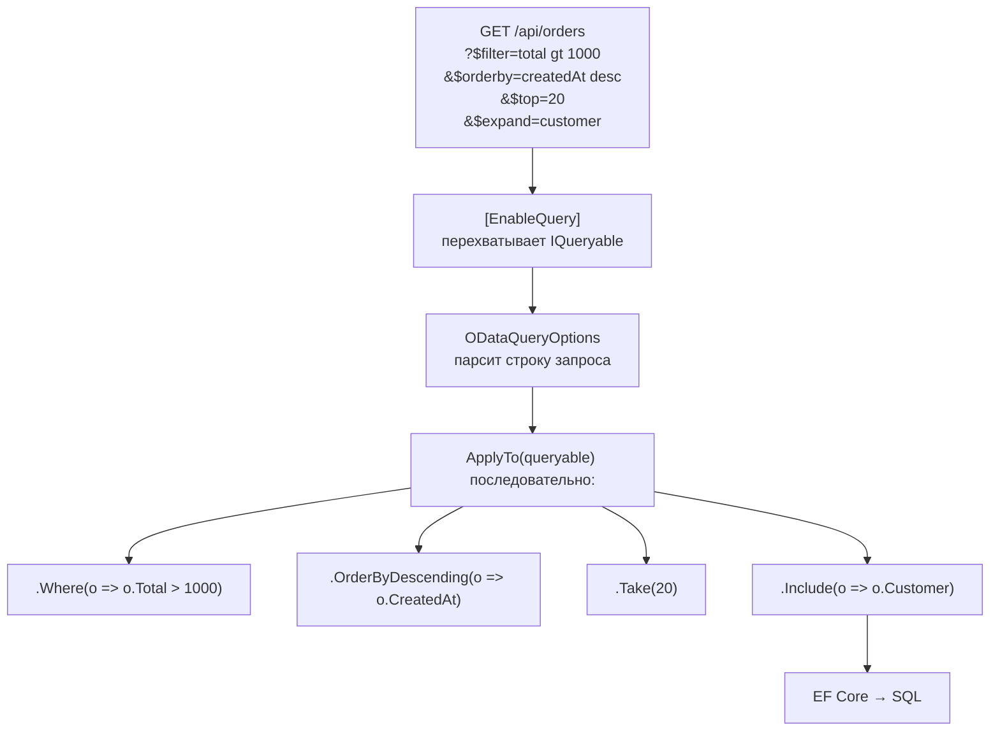

# OData

> OData — когда клиент должен сам строить произвольные запросы без новых endpoint'ов. Правильный выбор для BI-интеграции, неправильный — для высоконагруженных микросервисов.

## Содержание
- [Что такое OData и когда использовать](#что-такое-odata-и-когда-использовать)
- [Query Options](#query-options)
- [Как [EnableQuery] транслирует в SQL](#как-enablequery-транслирует-в-sql)
- [Microsoft.AspNetCore.OData — реализация](#microsoftaspnetcoreodata--реализация)
- [EDM и метаданные](#edm-и-метаданные)
- [Actions и Functions](#actions-и-functions)
- [Подводные камни](#подводные-камни)
- [См. также](#см-также)

---

## Что такое OData и когда использовать

OData (Open Data Protocol) — стандарт OASIS для REST API с гибкой системой запросов прямо в URL. Клиент фильтрует, сортирует, выбирает поля и раскрывает связи — без написания новых endpoint'ов на сервере.

Разработан Microsoft, используется в: Microsoft 365 API, Azure DevOps, Dynamics 365, Power BI.

**Когда OData оправдан:**

| Сценарий | Почему OData |
|---------|-------------|
| BI-интеграция (Power BI, Excel) | Читают `$metadata` автоматически, строят запросы сами |
| Административные интерфейсы | Ad-hoc фильтры без деплоя нового кода |
| Партнёрские интеграции | Клиент строит нужные ему запросы |

**Когда OData избыточен:**

| Сценарий | Почему не OData |
|---------|----------------|
| Высоконагруженные микросервисы | OData генерирует сложные запросы, трудно оптимизировать |
| Публичный API с фиксированным контрактом | REST + OpenAPI проще и безопаснее |
| Mobile API | GraphQL решает over/under-fetching лучше |

---

## Query Options

OData v4 системные опции запроса — добавляются к URL через `$` префикс.

### $select — выбрать поля

```
GET /api/orders?$select=id,status,total

→ SELECT id, status, total FROM orders
```

### $filter — фильтрация

```
GET /api/orders?$filter=status eq 'Confirmed'
GET /api/orders?$filter=total gt 1000 and status ne 'Cancelled'
GET /api/orders?$filter=contains(customer/name, 'Alice')
GET /api/orders?$filter=createdAt ge 2024-01-01T00:00:00Z
GET /api/orders?$filter=items/any(i: i/price gt 100)
GET /api/orders?$filter=id in (1, 2, 3, 4)
```

Операторы: `eq ne gt ge lt le and or not in`
Функции строк: `contains startswith endswith length toupper tolower`
Функции дат: `year month day hour minute second`
Коллекции: `any(x: condition)`, `all(x: condition)`

### $orderby — сортировка

```
GET /api/orders?$orderby=total desc,createdAt asc
```

### $top и $skip — пагинация

```
GET /api/orders?$top=20&$skip=40    ← страница 3 с размером 20
```

### $expand — раскрыть связанные сущности (аналог JOIN)

```
GET /api/orders?$expand=customer,items($expand=product)

→ JOIN customers
→ JOIN order_items JOIN products
```

Вложенный expand с выбором полей:
```
GET /api/orders?$expand=customer($select=name,email)
```

### $count — количество записей

```
GET /api/orders?$count=true

→ { "@odata.count": 1000, "value": [...] }
```

### $search — полнотекстовый поиск

```
GET /api/orders?$search="express delivery"
```

### Комбинация опций

```
GET /api/orders
    ?$filter=status eq 'Pending'
    &$select=id,total
    &$expand=customer($select=name,email)
    &$orderby=total desc
    &$top=10
    &$count=true
```

Эквивалентный SQL:

```sql
SELECT o.id, o.total, c.name, c.email
FROM orders o
JOIN customers c ON c.id = o.customer_id
WHERE o.status = 'Pending'
ORDER BY o.total DESC
LIMIT 10;
-- + отдельный COUNT(*)
```

---

## Как [EnableQuery] транслирует в SQL



`[EnableQuery]` работает через LINQ expression composition — дополнительные условия добавляются к существующему `IQueryable<T>` до исполнения запроса. БД получает один финальный SQL.

---

## Microsoft.AspNetCore.OData — реализация

```xml
<PackageReference Include="Microsoft.AspNetCore.OData" Version="8.2.5" />
```

```csharp
// Program.cs
var edmModel = BuildEdmModel();

builder.Services.AddControllers()
    .AddOData(options => options
        .AddRouteComponents("api", edmModel)
        .Select()       // разрешить $select
        .Filter()       // разрешить $filter
        .OrderBy()      // разрешить $orderby
        .Expand()       // разрешить $expand
        .Count()        // разрешить $count
        .SetMaxTop(100) // ограничить $top
    );

app.MapControllers();
```

```csharp
[ApiController]
[Route("api/[controller]")]
public class OrdersController : ODataController
{
    private readonly AppDbContext _db;

    public OrdersController(AppDbContext db) => _db = db;

    // [EnableQuery] перехватывает IQueryable и применяет OData параметры
    [HttpGet]
    [EnableQuery(MaxExpansionDepth = 3, MaxTop = 100)]
    public IQueryable<Order> Get()
        => _db.Orders
            .Include(o => o.Customer)
            .Include(o => o.Items)
                .ThenInclude(i => i.Product);

    // SingleResult для одного элемента
    [HttpGet("{key:long}")]
    [EnableQuery]
    public SingleResult<Order> Get([FromRoute] long key)
        => SingleResult.Create(_db.Orders.Where(o => o.Id == key));

    [HttpPost]
    public async Task<IActionResult> Post([FromBody] Order order)
    {
        if (!ModelState.IsValid) return BadRequest(ModelState);
        _db.Orders.Add(order);
        await _db.SaveChangesAsync();
        return Created(order);
    }

    // Delta<T> — частичное обновление, только изменённые поля
    [HttpPatch("{key:long}")]
    public async Task<IActionResult> Patch([FromRoute] long key, [FromBody] Delta<Order> delta)
    {
        var order = await _db.Orders.FindAsync(key);
        if (order is null) return NotFound();
        delta.Patch(order);  // применяет только изменённые поля из тела запроса
        await _db.SaveChangesAsync();
        return Updated(order);
    }

    [HttpDelete("{key:long}")]
    public async Task<IActionResult> Delete([FromRoute] long key)
    {
        var order = await _db.Orders.FindAsync(key);
        if (order is null) return NotFound();
        _db.Orders.Remove(order);
        await _db.SaveChangesAsync();
        return NoContent();
    }
}
```

---

## EDM и метаданные

**EDM (Entity Data Model)** — описание схемы данных для OData. Определяет типы, связи, ключи.

```csharp
private static IEdmModel BuildEdmModel()
{
    var builder = new ODataConventionModelBuilder();

    // EntitySet — коллекция с CRUD-операциями
    var orders = builder.EntitySet<Order>("Orders");
    orders.EntityType.HasKey(o => o.Id);
    orders.EntityType.HasMany(o => o.Items);
    orders.EntityType.HasRequired(o => o.Customer);

    builder.EntitySet<Customer>("Customers");
    builder.EntitySet<Product>("Products");

    // OData Functions — только чтение (GET)
    var function = builder.EntityType<Order>()
        .Collection
        .Function("GetByStatus")
        .ReturnsCollectionFromEntitySet<Order>("Orders");
    function.Parameter<string>("status");

    // OData Actions — изменяют состояние (POST)
    builder.EntityType<Order>()
        .Action("Cancel")
        .Returns<bool>();

    return builder.GetEdmModel();
}
```

**Метаданные доступны по URL:**

```
GET /api/$metadata
→ XML CSDL документ (Common Schema Definition Language)
```

Power BI и Excel используют `$metadata` для автоматического обнаружения структуры — подключаются к OData источнику и сами строят нужные запросы.

```
GET /api/
→ { "@odata.context": "$metadata", "value": [
    { "name": "Orders",    "kind": "EntitySet", "url": "Orders" },
    { "name": "Customers", "kind": "EntitySet", "url": "Customers" }
]}
```

---

## Actions и Functions

**OData Function** — read-only операция, GET-запрос:

```csharp
// Регистрация в EDM (см. выше)
// URL: GET /api/orders/GetByStatus(status='Pending')
[HttpGet("GetByStatus(status={status})")]
[EnableQuery]
public IQueryable<Order> GetByStatus([FromRoute] string status)
    => _db.Orders.Where(o => o.Status.ToString() == status);
```

**OData Action** — изменяет состояние, POST-запрос:

```csharp
// URL: POST /api/orders(42)/Cancel
[HttpPost("({key})/Cancel")]
public async Task<IActionResult> Cancel([FromRoute] long key)
{
    var order = await _db.Orders.FindAsync(key)
        ?? throw new ODataError(
               statusCode: (int)HttpStatusCode.NotFound,
               message: $"Order {key} not found");

    order.Status = OrderStatus.Cancelled;
    await _db.SaveChangesAsync();
    return Ok(true);
}
```

---

## Подводные камни

**`[EnableQuery]` без ограничений — DoS вектор.** Клиент может написать `$expand=items($expand=product($expand=category($expand=...)))` — бесконечные JOINы. Всегда задавай лимиты:

```csharp
[EnableQuery(
    MaxExpansionDepth = 2,
    MaxTop = 100,
    MaxNodeCount = 100,
    MaxAnyAllExpressionDepth = 2
)]
```

**OData и `IQueryable` leaking.** `[EnableQuery]` применяет фильтры к `IQueryable` — это значит бизнес-логика обходится. Если в репозитории есть условие `WHERE deleted = false`, но клиент передаёт `$filter=deleted eq true` — нужно правильно выстраивать composed query.

**`$filter` с функциями → Seq Scan.** `contains(name, 'Alice')` транслируется в `LIKE '%Alice%'` — не использует B-tree индекс. Для полнотекстового поиска нужен GIN-индекс и `tsvector`.

**Delta<T> и валидация.** `delta.Patch(order)` применяет только те поля, которые пришли в запросе. Нет встроенной валидации изменений. Нужно вызывать `TryGetPropertyValue` для проверки конкретных полей перед применением.

**OData версионирование.** При изменении схемы (добавление/удаление полей) старые клиенты могут сломаться. Версионируй через URL prefix: `/api/v1/orders`, `/api/v2/orders` — каждая версия регистрирует свою EDM модель.

---

## См. также

- [01-rest-design.md](./01-rest-design.md) — OData строится поверх REST
- [08-comparison.md](./08-comparison.md) — OData vs GraphQL: ad-hoc запросы, аудитория
