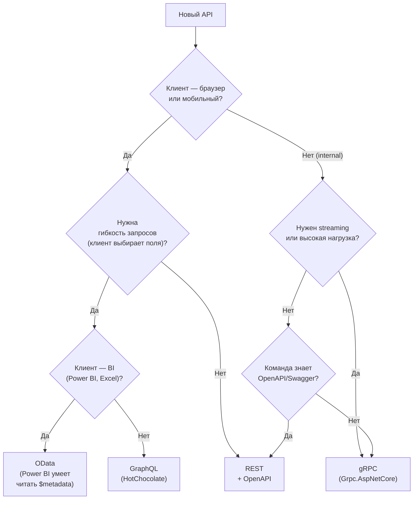
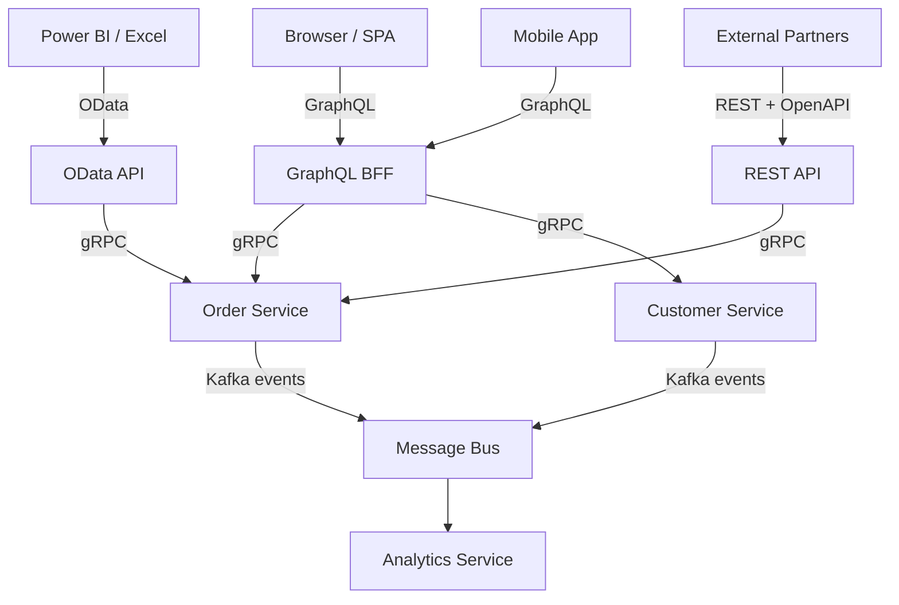

# REST vs gRPC vs GraphQL vs OData — сравнение

> Не бывает "лучшего" протокола. Есть правильный протокол для конкретного клиента, нагрузки и команды. В реальных системах все четыре сосуществуют.

## Содержание
- [Сравнительная таблица](#сравнительная-таблица)
- [Дерево выбора протокола](#дерево-выбора-протокола)
- [Типичные сценарии применения](#типичные-сценарии-применения)
- [Over-fetching и Under-fetching](#over-fetching-и-under-fetching)
- [Версионирование контракта](#версионирование-контракта)
- [Комбинирование протоколов](#комбинирование-протоколов)
- [Подводные камни при выборе](#подводные-камни-при-выборе)

---

## Сравнительная таблица

| Критерий | REST | gRPC | GraphQL | OData |
|----------|:----:|:----:|:-------:|:-----:|
| Протокол | HTTP/1.1–3 | HTTP/2 | HTTP/1.1–2 | HTTP/1.1–2 |
| Формат | JSON/XML | Protobuf (binary) | JSON | JSON/Atom |
| Типизация контракта | Слабая (OpenAPI) | Строгая (IDL) | Строгая (SDL) | Строгая (EDM) |
| Streaming | ❌ | ✅ 4 типа | Только subscriptions | ❌ |
| HTTP кеширование | ✅ GET | ❌ (сложно) | ❌ (POST) | ✅ GET |
| Браузер | ✅ | ⚠️ gRPC-Web | ✅ | ✅ |
| Производительность | Средняя | Высокая | Средняя | Низкая |
| Over-fetching | Есть | Нет | Нет | Нет ($select) |
| Under-fetching | Есть | Нет (явный дизайн) | Нет | Нет ($expand) |
| Документация | OpenAPI/Swagger | Proto + Reflection | Introspection | $metadata |
| Кривая обучения | Низкая | Средняя | Высокая | Средняя |
| N+1 риск | Низкий | Низкий | Высокий (DataLoader!) | Средний |

---

## Дерево выбора протокола



---

## Типичные сценарии применения

| Сценарий | Рекомендация | Почему |
|---------|-------------|--------|
| Публичный API для сторонних разработчиков | **REST** | Низкий порог входа, OpenAPI документация, HTTP-кеш |
| Internal service-to-service | **gRPC** | Производительность, типобезопасность, streaming |
| Мобильное приложение (ограниченный трафик) | **GraphQL** | Клиент запрашивает ровно нужные поля, экономия трафика |
| BFF (Backend for Frontend) | **GraphQL** | Один endpoint для web/mobile/tv с разными полями |
| BI-интеграция (Power BI, Excel) | **OData** | Автоматическое обнаружение схемы через $metadata |
| Real-time (чат, биржа, уведомления) | **gRPC streaming** | Двунаправленный стриминг, низкая латентность |
| Admin CRUD-интерфейс | **OData или REST** | Ad-hoc фильтры без нового кода |
| Event-driven микросервисы | **gRPC** (sync) + Kafka (async) | gRPC для синхронных вызовов, Kafka для событий |

---

## Over-fetching и Under-fetching

**REST:**

```
Экран профиля пользователя — нужны: имя, аватар, количество заказов.

GET /users/42
← { id, name, email, avatar, phone, address, createdAt, roles, ... }
  ↑ 80% данных не нужны (over-fetching)

Нужно ещё количество заказов:
GET /users/42/orders/count
← { count: 17 }
  ↑ второй запрос (under-fetching)
```

**GraphQL:**

```graphql
query {
    user(id: 42) {
        name
        avatar
        orders { totalCount }   # Relay connection
    }
}
← один запрос, ровно нужные поля
```

**gRPC:**

```protobuf
// Нет over-fetching по дизайну — контракт строгий
// Но нет гибкости — клиент не может выбрать поля
message UserProfileResponse {
    string name   = 1;
    string avatar = 2;
    int32  order_count = 3;
}
// Нужен отдельный метод или нужно договариваться о полях заранее
```

**OData:**

```
GET /api/users/42?$select=name,avatar&$expand=orders($count=true)
← { name, avatar, orders@odata.count: 17 }
  ↑ клиент выбирает поля через $select/$expand
```

---

## Версионирование контракта

| Протокол | Стратегия | Backward compatibility |
|----------|-----------|----------------------|
| **REST** | URL path `/v2/`, header, query param | Ручная (новые поля добавлять безопасно, удалять нет) |
| **gRPC** | Package namespace `orders.v2`, новые поля безопасны | Встроенная: добавить поле = безопасно, `reserved` для удалённых |
| **GraphQL** | Schema evolution: `@deprecated` для устаревших полей | Безопасно добавлять поля, небезопасно удалять |
| **OData** | URL prefix `/api/v2/`, OData-Version header | Ручная, новая EDM-модель для новой версии |

```protobuf
// gRPC: новые поля добавляются без breaking change
// Старые клиенты игнорируют неизвестные поля
message OrderResponse {
    int64 id     = 1;
    string name  = 2;
    // Добавили в v2 — старые клиенты не знают, просто игнорируют
    string email = 3;
}
```

```graphql
# GraphQL: @deprecated не удаляет поле, только помечает
type Order {
    id: ID!
    status: OrderStatus! @deprecated(reason: "Use statusV2")
    statusV2: OrderStatusV2!
}
```

---

## Комбинирование протоколов

В реальных системах протоколы сосуществуют на разных слоях:



**GraphQL как BFF (Backend for Frontend):**
- Клиенты (web, mobile) работают с GraphQL
- GraphQL BFF вызывает downstream gRPC сервисы
- Один endpoint для разных клиентов с разными потребностями в полях

**REST для публичного API + gRPC внутри:**
- Внешние клиенты: REST, OpenAPI документация, HTTP-кеш
- Внутренние сервисы: gRPC, protobuf, streaming

---

## Подводные камни при выборе

**GraphQL не убивает N+1 автоматически.** Неправильно настроенный GraphQL хуже чем REST — DataLoader нужно писать и регистрировать вручную для каждой связи. Без DataLoader 100 заказов = 101 запрос к БД.

**gRPC не работает из браузера напрямую.** Нужен gRPC-Web middleware или API Gateway. Если браузер — первый клиент, стоимость инфраструктуры gRPC возрастает.

**OData в высоконагруженных сервисах — риск.** Клиент может написать запрос с `$expand` на 5 уровней и `$filter` без индекса. Без жёстких ограничений `[EnableQuery]` — СУБД ляжет.

**REST с версионированием накапливает legacy.** Через 3 года — `/v1`, `/v2`, `/v3` с похожей логикой. gRPC с `reserved` полями и protobuf backward compatibility держит один endpoint дольше.

**«Давайте используем GraphQL» без DataLoader** — антипаттерн. GraphQL сложнее REST, и без понимания N+1 производительность хуже нуля. Решение: обязательно внедрять DataLoader с первого дня.
